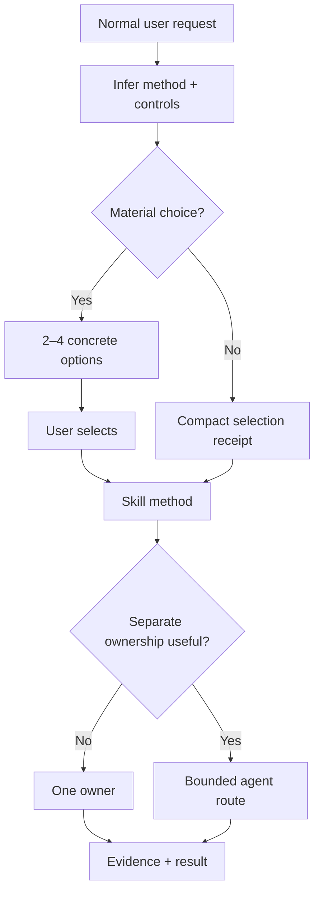
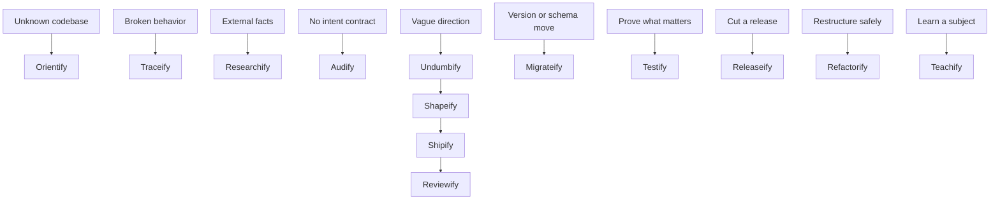

# Skillify

[](LICENSE)
[](#skills)
[](#agent-roles)
[](#native-agent-adapters)

> **Natural requests first. Choice cards before ceremony. Portable methods underneath.**

Skillify is a set of tested working methods for AI coding assistants. Each method packs
years of engineering scar tissue — debug like an engineer, plan like an architect,
migrate without downtime — into a form any major harness can load. You talk normally;
the method picks itself and asks only the questions worth asking.

> [!TIP]
> New here? Start with the **[15-minute hands-on tutorial](TUTORIAL.md)**. It begins with
> ordinary prompts—no skill names or control syntax to memorize.

## See it work

You write what you actually mean:

```text
I want login to feel faster and safer. Supply the missing decisions and ask only
questions that can change the architecture.
```

Instead of making you memorize command names, Skillify infers the right method and
offers the realistic ways to run it:

```text
How should I handle the login idea?

1. Balanced (recommended) — Supply missing security and UX decisions, then ask only
   architecture-changing questions.
   Undumbify · Standard · Concise · Solo

2. Fast — Use conservative assumptions and stop only on a blocking product decision.
   Undumbify · Light · Terse · Solo

3. Guided — Explain each missing decision without assuming authentication knowledge.
   Undumbify · Standard · Detailed · Layman · Solo

4. Customize — Choose rigor, response length, and ownership.
```

Pick one. Work starts on your terms — and routine requests skip the menu entirely,
opening with a one-line receipt instead:

```text
Selected: Traceify · Standard · Concise · Solo
```

That's the whole pitch: ordinary language in, senior-engineer discipline out, choices
only when they're real.

## Try it in two minutes

```bash
git clone https://github.com/trykA123/skillify.git
cd skillify
./install.sh --harness codex,claude,opencode,copilot --update
```

Restart your assistant and type a normal request. That's it — the methods are live.
Full installation options, including project-local copies and Claude plugin packaging,
are under [Installation](#installation).

## How a request becomes work



Three ideas carry everything:

- **Skills own methods.** Traceify owns debugging, Shipify owns execution. Each is a
  short, tested playbook.
- **Agent roles own authority.** When work needs multiple owners, the fleet splits it:
  a planner writes the plan, one worker edits code, a reviewer judges the result. Only
  one role ever edits your code at a time.
- **Adapters own the wiring.** The methods above are portable text. Small generated
  adapters map them onto Codex, Claude Code, OpenCode, and VS Code tool names. No model
  names or vendor syntax ever enters the portable source.

A route card appears only when routes are genuinely contested after a quick look, the
work is Heavy, or a step is destructive. Everything else starts immediately on a
receipt — ceremony scales with risk, not with verbosity. After you confirm a route,
delegated agents inherit it instead of showing you another menu.

## Choice cards

When a card is due, it shows two to four mutually exclusive entries. The recommended
option comes first. Each option says what changes in plain language; compact technical
selection is secondary. Choose `4` to open the explained second stage:

```text
Customize this run

Weight:      W1 Light · W2 Standard · W3 Heavy
Verbosity:   V1 Terse · V2 Concise · V3 Detailed
Ownership:   O1 Solo · O2 Team · O3 Custom team
Optional:    Explanation E1 Layman · E2 Operational · E3 Expert

Current: W2 · V2 · O1
Reply with all values or only changes. Example: W1 V2 O2
```

`Team` produces the smallest exact role proposal for confirmation; it never adds the
full fleet automatically. A selected route never grants destructive authority or moves a
product decision away from you.

Details live in the portable [selection contract](agents/contracts/selection.md) and
[customization contract](agents/contracts/customization.md).

## Controls

Four independent knobs, inferred so you can ignore them, named so you can pin them:

### Weight controls rigor

| Weight | Use it for | Typical proof |
|---|---|---|
| **Light** | Small, reversible, single-owner work | Inline intent, direct check, diff inspection |
| **Standard** | Normal features and multi-file work | Standalone packet, mapped acceptance, review |
| **Heavy** | Production data, auth, schema, deployment, public contracts, irreversible or coordinated work | Recovery proof, named owners, isolated writer, independent review |

Weight never grants permission. New risk promotes it; it is never silently demoted.

### Verbosity controls length

| Verbosity | User-facing result |
|---|---|
| **Terse** | Outcome, blocking risk, required decision |
| **Concise** | Outcome, decisive evidence, deviations, next action |
| **Detailed** | Adds rationale, alternatives, coverage, and residual uncertainty |

Default: **Concise**.

### Explanation controls assumed knowledge

Opt in by naming a level; otherwise Operational applies silently.

| Explanation | Assumption |
|---|---|
| **Layman** | No specialist vocabulary; ordinary language without childish simplification |
| **Operational** | Explain what changes action, risk, or verification |
| **Expert** | Assume domain fluency; define only local or surprising terms |

### Ownership controls topology

| Ownership | Meaning |
|---|---|
| **Solo** | The current owner completes the task |
| **Team** | The harness proposes the smallest useful role map for confirmation |
| **Custom team** | You name roles; the harness validates capabilities and writer boundaries |

A parent can coordinate a simple handoff. An Orchestrator joins only when coordination
itself is substantial: parallel lanes, branching handoffs, several roles, integration
ownership, or an iterative repair loop.

> [!TIP]
> `Heavy + Terse + Expert` means deep evidence and a short expert-facing answer.
> `Light + Detailed + Layman` means a small task explained carefully in ordinary language.

## Skills

Fourteen methods. Entry skills diagnose from outside; pipeline skills carry work through;
teaching skills transfer knowledge.

| Family | Skill | Use it when |
|---|---|---|
| Entry | [Orientify](entry/orientify/README.md) | You need a real codebase map before planning |
| Entry | [Traceify](entry/traceify/README.md) | Something is broken and the cause is unknown |
| Entry | [Researchify](entry/researchify/README.md) | A decision depends on current external evidence |
| Entry | [Audify](entry/audify/README.md) | A subject has no intent contract and needs a measurable condition report |
| Pipeline | [Undumbify](pipeline/undumbify/README.md) | A direction needs experienced missing decisions |
| Pipeline | [Shapeify](pipeline/shapeify/README.md) | Settled intent needs an executable packet |
| Pipeline | [Migrateify](pipeline/migrateify/README.md) | Dependencies, frameworks, or stored data must move versions safely |
| Pipeline | [Shipify](pipeline/shipify/README.md) | Approved work must be implemented and verified |
| Pipeline | [Reviewify](pipeline/reviewify/README.md) | Work must be judged against intent |
| Pipeline | [Testify](pipeline/testify/README.md) | Tests must prove behavior worth catching |
| Pipeline | [Releaseify](pipeline/releaseify/README.md) | Merged work must ship with an honest version and a rollback plan |
| Pipeline | [Refactorify](pipeline/refactorify/README.md) | Structure must improve while behavior holds still |
| Teaching | [Teachify](teaching/teachify/README.md) | A topic needs an interactive HTML lesson and exercises |
| Meta | [Skillify](teaching/skillify/README.md) | You want help choosing a method or agent route |



These are routes, not mandatory pipelines. Stop as soon as one method can safely own the
outcome.

## Agent roles

Eleven roles. One writes code; everything else inspects, plans, verifies, remembers, or
teaches.

| Group | Role | Owns |
|---|---|---|
| Memory | [Archivist](agents/guides/archivist/README.md) | Durable decision memory across sessions |
| Oversight | [Orchestrator](agents/guides/orchestrator/README.md) | Smallest useful topology and verified handoffs |
| Oversight | [Oracle](agents/guides/oracle/README.md) | Decision-consistency checks on clean context |
| Session | [Questar](agents/guides/questar/README.md) | Long exploration and decision continuity |
| Recon | [Scout](agents/guides/scout/README.md) | Fast exact code locations |
| Recon | [Context Builder](agents/guides/context-builder/README.md) | A no-rediscovery context pack |
| Recon | [Researcher](agents/guides/researcher/README.md) | Focused external evidence |
| Pipeline | [Planner](agents/guides/planner/README.md) | An executable packet |
| Pipeline | [Worker](agents/guides/worker/README.md) | The single product-code writer lane |
| Pipeline | [Reviewer](agents/guides/reviewer/README.md) | Independent judgment and one verdict |
| Teaching | [Teacher](agents/guides/teacher/README.md) | An evidence-grounded interactive lesson |

Only Worker may edit product code. Other roles are read-only or limited to their declared
artifacts. See the [fleet guide](agents/README.md) and [manifest](agents/manifest.json).

## Teachify

Teachify uses one stable subject and adapts vocabulary, abstraction, examples, questions,
and depth across five learner levels: **Layman → Beginner → Practitioner → Advanced →
Expert**. Level changes
the vocabulary, abstraction, examples, questions, and depth—not the learner's dignity.

Its default deliverable is a self-contained offline HTML lesson. Exercises give immediate
feedback:

- correct answers turn green and show `✓ Correct` plus the reasoning;
- incorrect answers turn red and show `✕ Not yet` plus corrective feedback;
- incorrect answers can be retried;
- colour is never the only signal;
- subjective free text is not fake-auto-graded.

The five-level adaptation is inspired by WIRED's
[Brian Greene explains time at five levels](https://www.youtube.com/watch?v=TAhbFRMURtg&t=138s).
Skillify adopts the pedagogical pattern, not the video's wording.

## Installation

Update or install skills globally:

```bash
./install.sh --harness codex,claude,opencode,copilot --update
```

Install one family or skill:

```bash
./install.sh --harness codex --family pipeline --update
./install.sh --harness claude --skill teachify --update
```

Copy instead of linking (for a project-local, checkout-independent install):

```bash
./install.sh --project --harness opencode --copy
```

Discover all 22 skill-directory presets:

```bash
./install.sh --list
./install.sh --list-skills
```

Use `--target /custom/skills` for an unlisted or customized harness. The installer refuses
unknown same-name entries unless `--force` is explicit. Managed retired entries are
removed during updates.

<details>
<summary><strong>Claude plugin installation</strong></summary>

```text
/plugin marketplace add trykA123/skillify
/plugin install skillify@skillify
```

Do not combine the plugin and direct Claude skill links for the same user; duplicate names
make update ownership ambiguous.

</details>

An external interactive installer is also available:

```bash
npx skills@latest add trykA123/skillify
```

That command downloads and runs an external package. Skillify does not depend on it at
runtime.

## Native agent adapters

Skills work everywhere out of the box. Agent roles additionally need a small generated
adapter per harness:

```bash
./install.sh \
  --harness codex,claude,opencode,copilot \
  --native-agents codex,claude,opencode,copilot \
  --with-agents \
  --update
```

Link the portable fleet alone:

```bash
./install.sh --agents-only --agents-target /path/to/fleets/skillify
```

The generator composes context-specific contract profiles, role-specific contracts, and
role instructions. Delegated definitions omit root-only selection and customization.
Roles marked `interaction: direct` in the manifest (currently Orchestrator, Planner,
Questar, Teacher) become selectable primary agents on OpenCode and user-invocable team
entries in VS Code; the other roles stay available as subagents. On Claude Code, direct
roles receive selection through their initial prompt. The generator maps capabilities to
native tools where supported, never chooses a model, records file hashes, refuses to
overwrite unmanaged definitions, and removes stale managed roles.

### VS Code and GitHub Copilot

Install personal skills and agents with the `vscode` alias:

```bash
./install.sh \
  --harness vscode \
  --native-agents copilot \
  --with-agents \
  --update
```

Restart VS Code. Type `/skills` to verify skill discovery (or open **Chat: Open
Customizations → Skills**) and `/agents` to open agent configuration. Use the normal
Copilot agent for ordinary skill-routed work, or select a direct role such as
**Orchestrator** when you want Team or Custom team ownership. Recon, writer, and review
roles are intentionally hidden from the dropdown and are available to the coordinating
role as subagents.

Personal installs use `~/.copilot/skills` and `~/.copilot/agents`. For a repository-local
install, run the installer from the target workspace:

```bash
cd /path/to/your-project
/path/to/skillify/install.sh --project --harness vscode --native-agents copilot --update
```

This writes `.github/skills` and `.github/agents`. These locations and `.agent.md` files
follow the official [VS Code skill](https://code.visualstudio.com/docs/agent-customization/agent-skills)
and [custom-agent](https://code.visualstudio.com/docs/agent-customization/custom-agents)
conventions.

Check freshness:

```bash
./install.sh --native-agents codex,claude,opencode,copilot --status
```

## Behavioral evaluations

Each skill has at least six behavioral cases. Fleet cases cover every role plus selection,
authority, communication, collision, capability, topology, and handoff behavior.

Static validation checks schemas and references:

```bash
node scripts/validate-core.mjs
```

The fixture adapter tests the executable runner without model usage:

```bash
node scripts/run-evals.mjs \
  --adapter fixture \
  --suite all \
  --out /tmp/skillify-fixture.jsonl
```

Run one paid/native case before a matrix:

```bash
node scripts/run-evals.mjs --adapter codex --suite teachify --limit 1 --out /tmp/codex.jsonl
node scripts/run-evals.mjs --adapter claude --suite teachify --limit 1 --out /tmp/claude.jsonl
node scripts/run-evals.mjs --adapter opencode --suite teachify --limit 1 --out /tmp/opencode.jsonl
```

Target one exact case with `--case <case-id>` while iterating on a behavior.

Natural-pause cases can exercise installed instructions without pasting the contract into
the candidate prompt:

```bash
node scripts/run-evals.mjs \
  --adapter codex \
  --installed \
  --suite orientify \
  --case orientify-login-natural-pause \
  --repeat 3
```

For Codex, this mode inspects native JSON events. Loading the selected `SKILL.md` is
allowed setup; a workspace command before the route choice fails the case.

Compare equal settings across revisions:

```bash
node scripts/compare-evals.mjs baseline.jsonl candidate.jsonl
```

See the [adapter guide](evals/adapters/README.md). Real harness runs use installed
authentication and may consume paid model usage.

## Prompt footprint

Markdown modularity helps maintenance, but it saves input only when the current context
does not load the module. Skillify measures eager entrypoints separately from conditional
references and root agents separately from delegated agents:

```bash
node scripts/report-token-footprint.mjs
node scripts/report-token-footprint.mjs --check
```

The report uses deterministic UTF-8 bytes and whitespace-delimited words. These are
cross-model proxies, not exact token counts. CI renders a budget table plus bar charts
into every run summary; run `node scripts/report-token-footprint.mjs --check` locally
to test against the reviewed limits in
[`evals/token-budgets.json`](evals/token-budgets.json).

## Verification

```bash
node scripts/validate-core.mjs
bash scripts/test-installer.sh
bash scripts/test-agent-adapters.sh
bash scripts/test-eval-runner.sh
bash scripts/test-token-footprint.sh
node teaching/teachify/scripts/validate-lesson.mjs teaching/teachify/assets/lesson-template.html
node scripts/test-teachify-interaction.mjs
```

GitHub Actions runs the same dependency-free checks on pushes and pull requests.

## Repository structure

```text
skillify/
├── entry/                 # orientation, diagnosis, research, audit
├── pipeline/              # intent, planning, migration, tests, releases, refactors
├── teaching/              # Teachify and the Skillify router
├── shared/                # the shared interaction gate, linked into every skill
├── agents/
│   ├── contracts/         # authority, selection, communication, handoffs
│   ├── roles/             # portable role contracts
│   ├── guides/            # human documentation
│   └── manifest.json      # capabilities and mutability
├── evals/                 # behavioral cases, schemas, and footprint budgets
├── scripts/               # validation, adapters, eval execution, tests, reports
├── .claude-plugin/        # optional Claude packaging adapter
├── install.sh
└── LICENSE
```

## Contributing

1. Keep vendor names, model choices, credential paths, and native tool syntax out of
   portable skill, role, and contract files.
2. Keep `SKILL.md` focused. Put conditional procedures, templates, and substantial
   examples in `references/`, `scripts/`, or `assets/`.
3. Use natural requests in documentation. Treat explicit controls as optional overrides.
4. Add at least one realistic activation case, one non-activation or boundary case, one
   choice-card case, and collision coverage where another method is plausible.
5. Run every verification command above before opening a pull request.

## License

[MIT](LICENSE) — use, modify, and redistribute the skills and role contracts, including in
commercial work, under the license terms.
