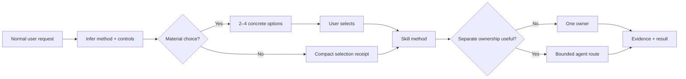
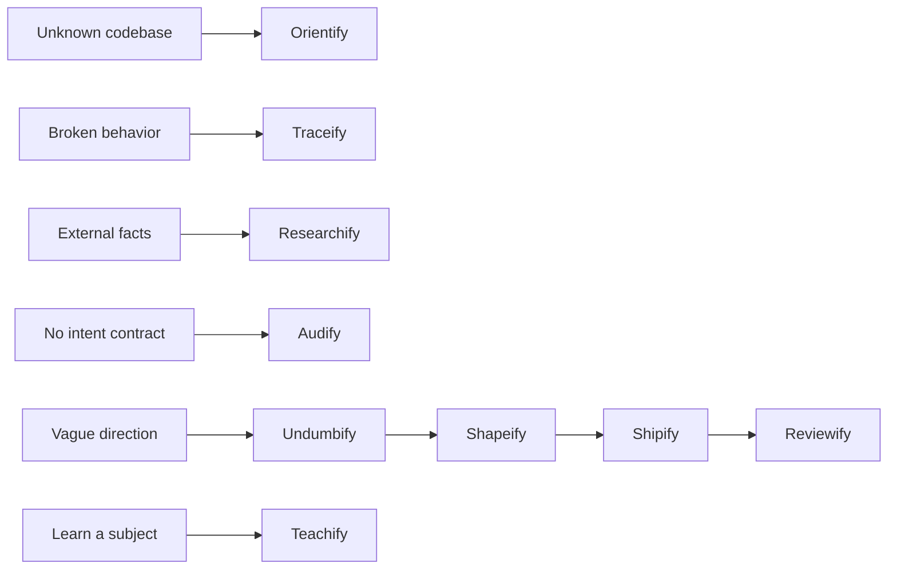
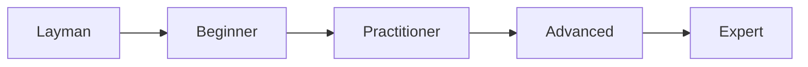

# Skillify

[](LICENSE)
[](#skills)
[](#agent-roles)
[](#native-agent-adapters)

> **Natural requests first. Choice cards before ceremony. Portable methods underneath.**

Skillify is a public collection of model-agnostic skills and agent-role contracts for
research, diagnosis, planning, execution, review, auditing, and interactive teaching.

You should not need to write this:

```text
Use Undumbify. Weight: Standard. Verbosity: Concise. Explanation: Operational.
```

Write the request you actually mean:

```text
I want login to feel faster and safer. Supply the missing decisions and ask only
questions that can change the architecture.
```

The harness infers the method and controls, then lets you choose how to proceed.

## Contents

- [How interaction works](#how-interaction-works)
- [Choice cards](#choice-cards)
- [Controls](#controls)
- [Skills](#skills)
- [Agent roles](#agent-roles)
- [Teachify](#teachify)
- [Installation](#installation)
- [Native agent adapters](#native-agent-adapters)
- [Behavioral evaluations](#behavioral-evaluations)
- [Repository structure](#repository-structure)
- [Contributing](#contributing)

## How interaction works

Skills own methods. Agent roles own authority and handoffs. Runtime adapters map portable
capabilities onto native tools and permissions.



The portable source contains no model selection, vendor tool names, credentials, or
runtime command syntax. Adapters make those deployment choices outside the skill and role
contracts.

## Choice cards

For substantial work, the harness presents two to four mutually exclusive approaches.
The recommended option comes first. Each option says what changes in plain language; the
compact technical selection is secondary.

```text
How should I handle the login idea?

1. Balanced (recommended) — Supply missing security and UX decisions, then ask only
   architecture-changing questions.
   Undumbify · Standard · Concise · Operational · Solo

2. Fast — Use conservative assumptions and stop only on a blocking product decision.
   Undumbify · Light · Terse · Operational · Solo

3. Guided — Explain each missing decision without assuming authentication knowledge.
   Undumbify · Standard · Detailed · Layman · Solo

4. Team — Separate context building and planning so the packet stands alone.
   Context Builder → Planner · Standard · Concise · Operational
```

Choose `1`, click the option in a harness with native choice controls, or describe a
custom preference. The selected route does not grant destructive authority or transfer a
product decision away from the user.

Tiny, reversible tasks may skip the menu:

```text
Selected: Shipify · Light · Concise · Operational · Solo
```

## Controls

Controls are independent and optional. The harness infers them; explicit values are useful
for automation, repeatable evals, or exact handoffs.

### Weight controls rigor

| Weight | Use it for | Typical proof |
|---|---|---|
| **Light** | Small, reversible, single-owner work | Inline intent, direct check, diff inspection |
| **Standard** | Normal features and multi-file work | Standalone packet, mapped acceptance, review |
| **Heavy** | Production data, auth, schema, deployment, public contracts, irreversible or coordinated work | Recovery proof, named owners, isolated writer, independent review |

Weight never grants permission. New risk can promote the weight; an explicit weight or a
Heavy trigger cannot be silently demoted.

### Verbosity controls length

| Verbosity | User-facing result |
|---|---|
| **Terse** | Outcome, blocking risk, required decision |
| **Concise** | Outcome, decisive evidence, deviations, next action |
| **Detailed** | Adds rationale, alternatives, coverage, and residual uncertainty |

Default: **Concise**.

### Explanation controls assumed knowledge

| Explanation | Assumption |
|---|---|
| **Layman** | No specialist vocabulary; ordinary language without childish simplification |
| **Operational** | Explain what changes action, risk, or verification |
| **Expert** | Assume domain fluency; define only local or surprising terms |

Default: **Operational**.

> [!TIP]
> `Heavy + Terse + Expert` means deep evidence and a short expert-facing answer.
> `Light + Detailed + Layman` means a small task explained carefully in ordinary language.

## Skills

| Family | Skill | Use it when |
|---|---|---|
| Entry | [Orientify](entry/orientify/README.md) | You need a real codebase map before planning |
| Entry | [Traceify](entry/traceify/README.md) | Something is broken and the cause is unknown |
| Entry | [Researchify](entry/researchify/README.md) | A decision depends on current external evidence |
| Entry | [Audify](entry/audify/README.md) | A subject has no intent contract and needs a measurable condition report |
| Pipeline | [Undumbify](pipeline/undumbify/README.md) | A direction needs experienced missing decisions |
| Pipeline | [Shapeify](pipeline/shapeify/README.md) | Settled intent needs an executable packet |
| Pipeline | [Shipify](pipeline/shipify/README.md) | Approved work must be implemented and verified |
| Pipeline | [Reviewify](pipeline/reviewify/README.md) | Work must be judged against intent |
| Teaching | [Teachify](teaching/teachify/README.md) | A topic needs an interactive HTML lesson and exercises |
| Meta | [Skillify](teaching/skillify/README.md) | You want help choosing a method or agent route |



These are routes, not mandatory pipelines. Stop as soon as one method can safely own the
outcome.

## Agent roles

| Group | Role | Owns |
|---|---|---|
| Oversight | [Orchestrator](agents/guides/orchestrator/README.md) | Smallest useful topology and verified handoffs |
| Oversight | [Oracle](agents/guides/oracle/README.md) | Decision-consistency checks on clean context |
| Session | [Questar](agents/guides/questar/README.md) | Long exploration and decision continuity |
| Recon | [Scout](agents/guides/scout/README.md) | Fast exact code locations |
| Recon | [Context Builder](agents/guides/context-builder/README.md) | A no-rediscovery context pack |
| Recon | [Researcher](agents/guides/researcher/README.md) | Focused external evidence |
| Pipeline | [Planner](agents/guides/planner/README.md) | An executable packet |
| Pipeline | [Worker](agents/guides/worker/README.md) | The single product-code writer lane |
| Pipeline | [Reviewer](agents/guides/reviewer/README.md) | Independent judgment and one verdict |
| Teaching | [Teacher](agents/guides/teacher/README.md) | An evidence-grounded interactive lesson |

Only Worker may edit product code. Other roles are read-only or limited to their declared
artifacts. See the [fleet guide](agents/README.md) and [manifest](agents/manifest.json).

## Teachify

Teachify uses one stable subject and adapts vocabulary, abstraction, examples, questions,
and depth across five learner levels:



Its default deliverable is a self-contained offline HTML lesson. Exercises give immediate
feedback:

- correct answers turn green and show `✓ Correct` plus the reasoning;
- incorrect answers turn red and show `✕ Not yet` plus corrective feedback;
- incorrect answers can be retried;
- colour is never the only signal;
- subjective free text is not fake-auto-graded.

The five-level adaptation is inspired by WIRED's
[Brian Greene explains time at five levels](https://www.youtube.com/watch?v=TAhbFRMURtg&t=138s).
Skillify adopts the pedagogical pattern, not the video's wording.

## Installation

Clone the repository and inspect the plan first:

```bash
git clone https://github.com/trykA123/skillify.git
cd skillify
./install.sh --harness codex,claude,opencode --dry-run
```

Install or update skills globally:

```bash
./install.sh --harness codex,claude,opencode --update
```

Install one family or skill:

```bash
./install.sh --harness codex --family pipeline --update
./install.sh --harness claude --skill teachify --update
```

Copy instead of linking:

```bash
./install.sh --project --harness opencode --copy
```

Discover all 22 skill-directory presets:

```bash
./install.sh --list
./install.sh --list-skills
```

Use `--target /custom/skills` for an unlisted or customized harness. The installer refuses
unknown same-name entries unless `--force` is explicit. Managed retired entries are
removed during updates.

<details>
<summary><strong>Claude plugin installation</strong></summary>

```text
/plugin marketplace add trykA123/skillify
/plugin install skillify@skillify
```

Do not combine the plugin and direct Claude skill links for the same user; duplicate names
make update ownership ambiguous.

</details>

An external interactive installer is also available:

```bash
npx skills@latest add trykA123/skillify
```

That command downloads and runs an external package. Skillify does not depend on it at
runtime.

## Native agent adapters

The portable fleet can be linked by itself:

```bash
./install.sh --agents-only --agents-target /path/to/fleets/skillify
```

Generate native, model-neutral agent definitions:

```bash
./install.sh \
  --harness codex,claude,opencode \
  --native-agents codex,claude,opencode \
  --with-agents \
  --update
```

The generator composes global contracts, role-specific contracts, and role instructions.
It maps capabilities to native tools where supported, never chooses a model, records file
hashes, refuses to overwrite unmanaged definitions, and removes stale managed roles.

Check freshness:

```bash
./install.sh --native-agents codex,claude,opencode --status
```

## Behavioral evaluations

Each skill has at least six behavioral cases. Fleet cases cover every role plus selection,
authority, communication, collision, capability, topology, and handoff behavior.

Static validation checks schemas and references:

```bash
node scripts/validate-core.mjs
```

The fixture adapter tests the executable runner without model usage:

```bash
node scripts/run-evals.mjs \
  --adapter fixture \
  --suite all \
  --out /tmp/skillify-fixture.jsonl
```

Run one paid/native case before a matrix:

```bash
node scripts/run-evals.mjs --adapter codex --suite teachify --limit 1 --out /tmp/codex.jsonl
node scripts/run-evals.mjs --adapter claude --suite teachify --limit 1 --out /tmp/claude.jsonl
node scripts/run-evals.mjs --adapter opencode --suite teachify --limit 1 --out /tmp/opencode.jsonl
```

Compare equal settings across revisions:

```bash
node scripts/compare-evals.mjs baseline.jsonl candidate.jsonl
```

See the [adapter guide](evals/adapters/README.md). Real harness runs use installed
authentication and may consume paid model usage.

## Verification

```bash
node scripts/validate-core.mjs
bash scripts/test-installer.sh
bash scripts/test-agent-adapters.sh
bash scripts/test-eval-runner.sh
node teaching/teachify/scripts/validate-lesson.mjs teaching/teachify/assets/lesson-template.html
node scripts/test-teachify-interaction.mjs
```

GitHub Actions runs the same dependency-free checks on pushes and pull requests.

## Repository structure

```text
skillify/
├── entry/                 # orientation, diagnosis, research, audit
├── pipeline/              # intent, planning, implementation, review
├── teaching/              # Teachify and the Skillify router
├── agents/
│   ├── contracts/         # authority, selection, communication, handoffs
│   ├── roles/             # portable role contracts
│   ├── guides/            # human documentation
│   └── manifest.json      # capabilities and mutability
├── evals/                 # portable behavioral cases and schemas
├── scripts/               # validation, adapters, eval execution, tests
├── .claude-plugin/        # optional Claude packaging adapter
├── install.sh
└── LICENSE
```

## Contributing

1. Keep vendor names, model choices, credential paths, and native tool syntax out of
   portable skill, role, and contract files.
2. Keep `SKILL.md` focused. Put conditional procedures, templates, and substantial
   examples in `references/`, `scripts/`, or `assets/`.
3. Use natural requests in documentation. Treat explicit controls as optional overrides.
4. Add at least one realistic activation case, one non-activation or boundary case, one
   choice-card case, and collision coverage where another method is plausible.
5. Run every verification command above before opening a pull request.

## License

[MIT](LICENSE) — use, modify, and redistribute the skills and role contracts, including in
commercial work, under the license terms.
