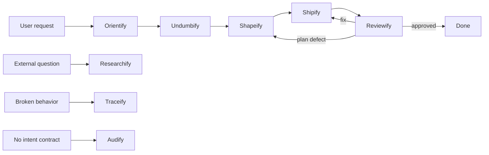
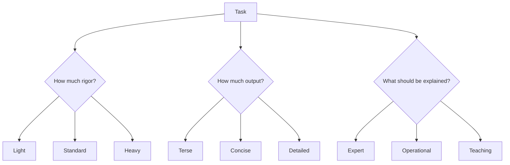
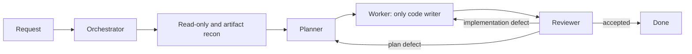
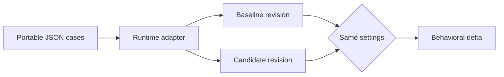

# Skillify

[](LICENSE)


> **Portable methods. Bounded roles. Runtime-specific adapters.**

Skillify is a portable set of skills and agent-role contracts for reliable AI-assisted
work. It separates the method, the role, and the runtime:

- A **skill** defines how to do a type of work.
- An **agent role** defines who owns a bounded part of the work.
- A **runtime adapter** maps portable capabilities to models, tools, permissions, and
  configuration for one environment.

The skill and role source files contain no model names, vendor tools, credentials, or
harness-specific commands. You can use the same contracts with different models and
agent runtimes.

<details>
<summary><strong>Explore this guide</strong></summary>

- [Why use it?](#why-use-it)
- [The system at a glance](#the-system-at-a-glance)
- [Three independent controls](#three-independent-controls)
- [Skills](#skills)
- [Agent fleet](#agent-fleet)
- [Install](#install-skills)
- [Examples](#use-the-skills)
- [Behavioral evaluations](#behavioral-evaluations)
- [Contributing contracts](#add-or-change-a-skill)

</details>

## Why use it?

AI workflows often fail in predictable ways. An agent starts editing before it knows
the codebase. A planner hides assumptions. A worker improvises when a step is wrong. A
reviewer comments on style instead of intent. An orchestrator creates many agents for a
small task and returns a long story about the process.

Skillify adds explicit boundaries:

- Evidence before claims.
- Intent before planning.
- A baseline before editing.
- One writer per working directory.
- Review against requirements, not taste.
- Output length independent from task risk.
- Plain technical language without filler or process theater.

## The system at a glance



You do not need the full pipeline for every task. A direct bug can start with Traceify.
A research question can use Researchify alone. A small, decision-ready edit can go
directly to Shipify with Light weight.

> [!TIP]
> Start with the smallest method that owns the problem. Add pipeline stages only when
> the next decision genuinely needs them.

## Three independent controls

Every task can carry three controls. They solve different problems.

### 1. Weight controls rigor

| Weight | Use it for | Typical evidence |
|---|---|---|
| **Light** | Small, reversible, single-owner work | Inline plan, targeted check, diff inspection |
| **Standard** | Normal features and multi-file work | Full packet, mapped acceptance, review |
| **Heavy** | Production data, auth, schema, deployment, irreversible or coordinated work | Recovery proof, named owners, isolated writers, independent review |

Weight never grants permission. Light does not bypass safety. Heavy does not imply a
long chat response. A task can be promoted when new risk appears. It cannot be silently
demoted below an explicit choice or a Heavy trigger.

### 2. Verbosity controls length

| Verbosity | Output |
|---|---|
| **Terse** | Outcome, blocking risk, and requested answer only |
| **Concise** | Outcome, decisive evidence, deviations, and next action |
| **Detailed** | Adds rationale, alternatives, coverage, and residual uncertainty |

Default: **Concise**.

### 3. Explanation controls assumed knowledge

| Explanation | Reader model |
|---|---|
| **Expert** | Assumes domain fluency; defines only local or surprising terms |
| **Operational** | Explains why a choice changes action, risk, or verification |
| **Teaching** | Explains mechanisms and unfamiliar terms with a useful example |

Default: **Operational**.

The controls compose. `Heavy + Terse + Expert` keeps deep proof in artifacts and returns
a short expert summary. `Light + Detailed + Teaching` keeps the change small but explains
the mechanism carefully.



> [!IMPORTANT]
> These axes are independent. Risk may increase verification without increasing the
> length or teaching depth of the response.

## Plain technical English

Technical output uses a pragmatic subset of Simplified Technical English:

- Use active voice and concrete verbs.
- Put a condition before its command.
- Keep one instruction in each sentence.
- Use one term for one concept.
- Remove filler, praise, and narration about the agent's own carefulness.
- Preserve code, identifiers, commands, paths, quoted errors, and facts exactly.

Strict ASD-STE100 vocabulary and sentence limits apply only when requested. This design
was informed by the MIT-licensed
[SimpleEnglish](https://github.com/AminBlg/SimpleEnglish) project. Skillify does not
depend on that project at runtime.

## Skills

| Family | Skill | Use it when |
|---|---|---|
| Entry | [Orientify](entry/orientify/README.md) | You need a real codebase map before decisions |
| Entry | [Traceify](entry/traceify/README.md) | Something is broken and needs a root cause |
| Entry | [Researchify](entry/researchify/README.md) | A decision depends on current external facts |
| Entry | [Audify](entry/audify/README.md) | A subject has no intent contract and needs an audit |
| Pipeline | [Undumbify](pipeline/undumbify/README.md) | A direction is vague or needs pressure-testing |
| Pipeline | [Shapeify](pipeline/shapeify/README.md) | Intent is settled but execution is not planned |
| Pipeline | [Shipify](pipeline/shipify/README.md) | You want an approved direction implemented |
| Pipeline | [Reviewify](pipeline/reviewify/README.md) | You need work judged against intent |
| Teaching | [Promptify](teaching/promptify/README.md) | You want one useful prompting lesson |
| Teaching | [Explainify](teaching/explainify/README.md) | You want code and its connections explained |
| Teaching | [Skillify](teaching/skillify/README.md) | You want to learn which skills and agents to use |
| Teaching | [Recordify](teaching/recordify/README.md) | You explicitly want a sanitized session record |
| Memory | [Librify](memory/librify/README.md) | You want to compile or recall verified lessons |

`SKILL.md` is the runtime entry point. A skill can also contain conditional modules:

```text
skill-name/
  SKILL.md
  README.md
  references/
  scripts/
  assets/
```

The weighted pipeline keeps Light, Standard, and Heavy instructions under
`references/weights/`. The entry point selects one weight and loads only its relevant
detail.

```text
skillify/
├── .claude-plugin/ # optional runtime packaging adapter
├── entry/       # orient, diagnose, research, audit
├── pipeline/    # clarify, plan, build, review
├── teaching/    # coach, explain, record
├── memory/      # compile and recall lessons
├── agents/      # portable roles and shared contracts
├── evals/       # behavioral cases and schemas
└── scripts/     # structural contract validation
```

## Agent fleet

The fleet contains ten narrow roles. Skills own methods. Roles own authority, capability
requirements, mutability, and handoffs.

| Role | Responsibility | Guide |
|---|---|---|
| Orchestrator | Selects the smallest topology and verifies handoffs | [Guide](agents/guides/orchestrator/README.md) |
| Oracle | Checks decision consistency from clean inherited context | [Guide](agents/guides/oracle/README.md) |
| Questar | Preserves decisions during long exploration | [Guide](agents/guides/questar/README.md) |
| Scout | Performs fast, exact codebase recon | [Guide](agents/guides/scout/README.md) |
| Context Builder | Produces a no-rediscovery context handoff | [Guide](agents/guides/context-builder/README.md) |
| Researcher | Performs focused external research | [Guide](agents/guides/researcher/README.md) |
| Planner | Produces an executable packet | [Guide](agents/guides/planner/README.md) |
| Worker | Owns the single product-code writer lane | [Guide](agents/guides/worker/README.md) |
| Reviewer | Reviews or audits without editing the subject | [Guide](agents/guides/reviewer/README.md) |
| Recorder | Writes a privacy-gated session record | [Guide](agents/guides/recorder/README.md) |

The portable [fleet manifest](agents/manifest.json) declares capabilities, mutability,
skills, shared contracts, aliases, weights, and output controls. A runtime adapter must
map those concepts to native tools and permissions. Runtime-specific models and tool
names do not belong in the fleet source.



## Install skills

Choose one installation style. Do not install the same skill through multiple styles in
the same harness; duplicate names make ownership and updates ambiguous.

### Interactive installer — quickest

The open [`skills` CLI](https://github.com/vercel-labs/skills) can discover this
repository, let you select skills and targets, and install to Claude Code, OpenCode,
Codex, Cursor, and many other compatible agents:

```bash
npx skills@latest add trykA123/skillify
```

Non-interactive example for every Skillify skill in Claude Code and OpenCode:

```bash
npx skills@latest add trykA123/skillify \
  --skill '*' \
  --agent claude-code \
  --agent opencode \
  --global \
  --yes
```

> [!NOTE]
> This option downloads and runs the external `skills` package. Review that tool before
> using it in a restricted environment. Skillify does not depend on it at runtime.

### Repository installer — deterministic and offline

Clone the repository, then use the bundled installer:

```bash
git clone https://github.com/trykA123/skillify.git
cd skillify
./install.sh --harness claude,opencode
```

Symlinks are the default. Pulling a new revision updates linked skills immediately.
Copied skills change only when you run the installer again with `--update`.

<details>
<summary><strong>Selection, safety, and inspection examples</strong></summary>

Install two skills only:

```bash
./install.sh --harness claude,opencode --skill traceify,skillify
```

Install one family except one skill:

```bash
./install.sh --harness codex --family pipeline --exclude reviewify
```

Preview without writing:

```bash
./install.sh --harness claude,opencode --dry-run
```

Inspect current installations:

```bash
./install.sh --harness claude,opencode --status
```

Refresh managed copies or repoint same-name symlinks safely:

```bash
./install.sh --harness claude,opencode --update
```

Install into a project or an arbitrary compatible directory:

```bash
./install.sh --project --harness universal --copy
./install.sh --target /path/to/skills
```

</details>

> [!NOTE]
> Presets only resolve installation directories. They do not put vendor or model logic
> into the portable skill and role contracts.

The bundled installer currently provides 22 presets plus aliases. Inspect their exact
global and project paths before installation:

```bash
./install.sh --list
./install.sh --list-skills
```

Use `--target` when a harness is absent from the list or uses a customized path.

### Claude Code managed plugin

Claude Code users can subscribe to the complete skill bundle through the repository's
plugin marketplace adapter:

```text
/plugin marketplace add trykA123/skillify
/plugin install skillify@skillify
```

The plugin follows [Claude Code's native skill and marketplace
format](https://code.claude.com/docs/en/plugin-marketplaces). Choose either the plugin
or a direct `~/.claude/skills` installation, not both.

### OpenCode native path

The `opencode` preset installs global skills to `~/.config/opencode/skills` and project
skills to `.opencode/skills`, matching [OpenCode's native skill discovery
paths](https://opencode.ai/docs/skills/):

```bash
./install.sh --harness opencode --update
./install.sh --project --harness opencode --copy
```

The separation between a managed Claude plugin and an editable multi-agent install was
inspired by [mattpocock/skills](https://github.com/mattpocock/skills). Skillify keeps its
own contracts, installer implementation, evals, and runtime-neutral architecture.

## Install the portable agent fleet

Add `--with-agents`:

```bash
./install.sh --harness codex --with-agents
```

Install or inspect only the fleet package:

```bash
./install.sh --agents-only --agents-target /path/to/fleets/skillify
./install.sh --agents-only --status
```

This installs the portable fleet package under `.agents/fleets/skillify` at project
scope or the corresponding global location. It does not put vendor-specific agent
configuration into the role contracts. A runtime can load this package directly or use
an adapter that composes:

1. Global fleet contracts.
2. Role-specific contracts.
3. The selected role file.
4. The role's skills.
5. Runtime capability and permission mappings.

If a runtime lacks a required capability, the adapter must fail before dispatch or
return the missing capability as a gap.

## Use the skills

Runtimes can select skills automatically from their names and descriptions. Explicit
invocation is the most portable approach.

### Example: learn the system

```text
Use Skillify.
Verbosity: Concise
Explanation: Teaching

Teach me the smallest skill and agent route for an intermittent production failure.
Explain when another role becomes useful and give me a reusable prompt.
```

### Example: small edit

```text
Use Shipify.
Weight: Light
Verbosity: Terse
Explanation: Expert

Change the timeout from 20 to 30 and run the direct unit test.
```

### Example: vague feature

```text
Use Undumbify, then Shapeify.
Weight: Standard
Verbosity: Concise
Explanation: Operational

I want login to feel faster and safer. Pressure-test the intent, then create an
executable plan. Do not implement it yet.
```

### Example: production migration

```text
Use Shapeify to create a Heavy packet for a production schema migration.
Verbosity: Terse
Explanation: Expert

Require a decision owner, proof owners, rollback, a recovery check, isolated writer
lanes, and independent review. Keep the chat summary short. Put full evidence in the
packet.
```

### Example: learn the code

```text
Use Explainify.
Verbosity: Detailed
Explanation: Teaching

Trace one request from the HTTP entry point to persistence. Explain the module
boundaries and one realistic failure path. Do not edit code.
```

## Use the agents

Choose the smallest useful topology. Do not dispatch the full fleet by default.

### Single writer with read-only support

```text
Weight: Standard
Verbosity: Concise
Explanation: Operational

Have Scout locate the flow. Have Planner create the packet. Give Worker the only code
writer lane. After acceptance passes, have Reviewer inspect the same revision.
```

### Parallel read-only review

```text
Weight: Heavy
Verbosity: Terse
Explanation: Expert

Use separate read-only lanes for contract safety and recovery evidence. Keep one
integration owner. Return one merged findings list. Do not narrate the orchestration.
```

Every handoff carries the assigned outcome, boundary, result, artifact locations,
checks, deviations, residual risks, and next valid owner. The selected verbosity changes
the presentation. It does not remove required evidence.

<details>
<summary><strong>See a complete portable handoff shape</strong></summary>

```yaml
outcome: "What the receiver must accomplish"
boundary: "Files, systems, and decisions inside scope"
weight: Standard
verbosity: Concise
explanation: Operational
result: "What the sender established"
artifacts: ["path/to/packet.md"]
checks: ["observable proof and result"]
deviations: []
residual_risks: []
next_owner: worker
```

</details>

## Behavioral evaluations

Skill evals live at `evals/<skill>/cases.json`. Fleet evals live at
`evals/agents/cases.json`. They test observable behavior instead of exact prose.

The current suites cover:

- Skill activation and non-activation.
- Weight and module routing.
- Authority and mutability.
- Single-writer topology.
- Missing capabilities.
- Handoff behavior.
- Verbosity and explanation independence.
- Forbidden actions and scope boundaries.

The repository supplies portable schemas and semantic expectations. A model adapter
owns model selection, harness invocation, repetitions, and grading. Compare a baseline
and candidate revision with the same adapter settings.



Validate all source contracts:

```bash
node scripts/validate-core.mjs
```

Run the privacy-gate tests:

```bash
bun test teaching/recordify/sanitize.test.mjs
```

Exercise installer selection, dry-run, status, update safety, and fleet handling:

```bash
bash scripts/test-installer.sh
```

## Add or change a skill

1. Keep selection, shared invariants, and routing in `SKILL.md`.
2. Move substantial conditional detail into linked references.
3. Add or update realistic cases under `evals/<skill>/cases.json`.
4. Add or update the skill's human-facing `README.md`.
5. Run structural validation and meaningful behavior checks.
6. Improve from observed failures. Do not accumulate generic rules for every example.

## Add or change an agent

1. Define a narrow role with a clear input, output, and boundary.
2. Add it to `agents/manifest.json` with capabilities, mutability, skills, and contracts.
3. Keep model and vendor settings in the runtime adapter.
4. Add selection, authority, capability, and handoff evals.
5. Add the agent guide under `agents/guides/<role>/README.md`.
6. Run validation and test at least one realistic fleet scenario.

## Security and permissions

- Skills and roles do not grant authority.
- Destructive actions still require explicit approval.
- Only Worker has product-code mutability in the portable fleet.
- Fetched code is never executed by Researchify.
- Recordify refuses session records that fail its privacy scan.
- Runtime credentials, tokens, private URLs, and local auth paths never belong in this
  repository.

## License

Skillify is available under the [MIT License](LICENSE). You can use, modify, and
redistribute it, including in commercial work, subject to the license terms.
