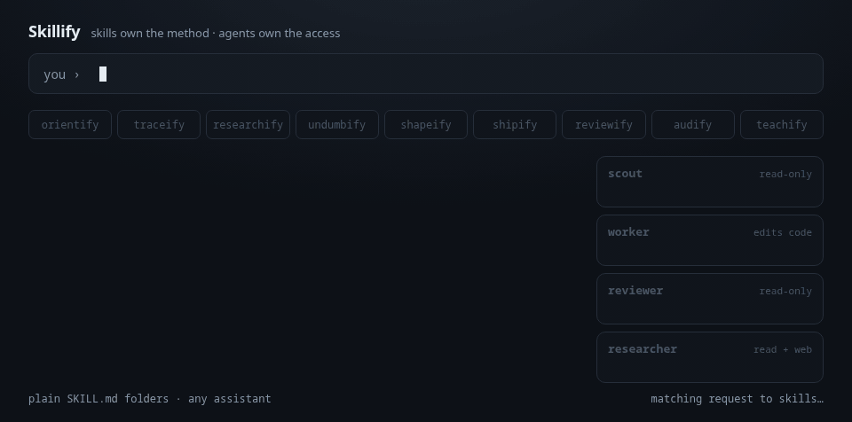

# Skillify

[](LICENSE)

Nine small engineering skills and four subagents for AI coding assistants. Each skill
holds the few rules a strong engineer follows and a model tends to skip: trace the
flow before planning, state the root cause before fixing, verify each step, and judge
work against its intent. The skills are plain `SKILL.md` folders, so they work in any
assistant that reads Agent Skills.



You write a normal request. The assistant matches it against the skill descriptions and
loads one skill; that skill's rules shape the work. Agents run a bounded part of the job
with only the access they need. The animation's source is [docs/tour.html](docs/tour.html).

## Skills

| Skill | Use it when | What it enforces |
|---|---|---|
| [orientify](skills/orientify/SKILL.md) | You are new to a codebase | One flow traced end to end; traps named, not fixed |
| [traceify](skills/traceify/SKILL.md) | Something broke and the cause is unknown | Falsifiable hypotheses; root cause stated before the fix |
| [researchify](skills/researchify/SKILL.md) | A decision needs outside facts | Source hierarchy, two independent sources, confidence labels |
| [undumbify](skills/undumbify/SKILL.md) | The idea is still vague | Supplies the missing decisions; asks only material questions |
| [shapeify](skills/shapeify/SKILL.md) | The goal is clear, the approach is not | Steps with file, check, and trap; plan amendments |
| [shipify](skills/shipify/SKILL.md) | Implement, refactor, migrate, test, or release | Baseline, verify each step, classify deviations, inspect the result |
| [reviewify](skills/reviewify/SKILL.md) | Review a diff, PR, or plan | Intent before diff, located findings, one verdict |
| [audify](skills/audify/SKILL.md) | Health check with no spec | Standard first, reproducible evidence, severity × effort, HTML report |
| [teachify](skills/teachify/SKILL.md) | Learn a topic properly | Interactive HTML lesson with graded exercises |

A typical feature runs `undumbify → shapeify → shipify → reviewify`, but each skill
stands alone. Use the one that fits the task in front of you.

## Subagents

| Agent | Access | Job |
|---|---|---|
| [scout](agents/scout.md) | read-only | Exact files and line ranges for another agent |
| [worker](agents/worker.md) | edits code | Implements one bounded task with evidence |
| [reviewer](agents/reviewer.md) | read-only (runs checks) | Independent review with one verdict |
| [researcher](agents/researcher.md) | read-only + web | Sourced external brief |

Agent definitions are portable Markdown. `scripts/render-agents.mjs` turns them into
each assistant's native format and enforces access with native tool lists or sandboxes.

## Install

```bash
git clone https://github.com/trykA123/skillify.git && cd skillify
./install.sh --update                                   # every detected assistant
./install.sh --harness claude,codex --native-agents claude,codex --update
./install.sh --target /path/to/skills                   # any other assistant
./install.sh --list                                     # 22 presets and their paths
```

Links by default; `--copy` for checkout-independent copies, `--project` for
repo-local folders, `--skill a,b` to pick skills, `--uninstall`, `--status`, `--dry-run`.
The installer never overwrites a directory or agent file it did not create, and it
removes skills retired from this repo.

Native subagents: `claude`, `codex`, `opencode`, `copilot` (alias `vscode`).

Claude Code plugin:

```text
/plugin marketplace add trykA123/skillify
/plugin install skillify@skillify
```

## Token cost

Only the skill descriptions are always in context: about 2.6 KB for all nine. A skill
body (2–3 KB) loads when it triggers, and references load only when the task needs
them. Agent prompts are about 1 KB. `node scripts/validate.mjs --report` prints the
current sizes and fails when a budget is exceeded.

## Develop

```bash
node scripts/validate.mjs          # frontmatter, links, budgets, installer and plugin lists
bash scripts/test.sh               # installer safety and all four agent formats
node scripts/run-evals.mjs --adapter claude --skill traceify --out /tmp/claude.jsonl
node scripts/compare-evals.mjs baseline.jsonl candidate.jsonl
```

Eval cases live in `evals/<skill>.json`. A case with `route` checks which skill a model
picks from the descriptions; a case with `behaviors` runs the skill and has the model
grade the answer against them. Real adapters use your installed CLI and may cost usage.

Rules for changes: keep vendor names and tool syntax out of skills and agents, keep
`SKILL.md` under 4.5 KB, move conditional detail into `references/`, and add at least
one route case and one behavior case per skill.

## License

[MIT](LICENSE)
