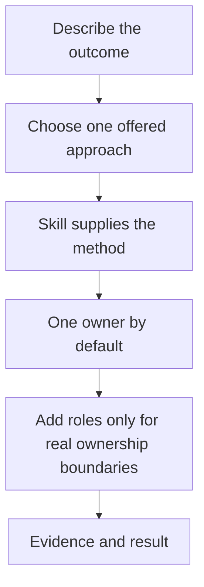
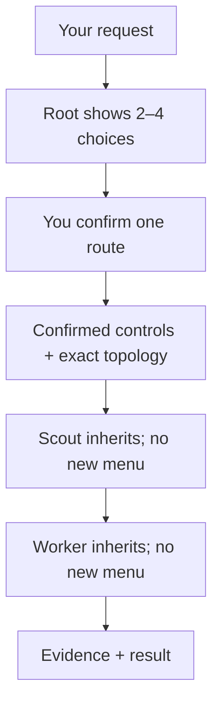
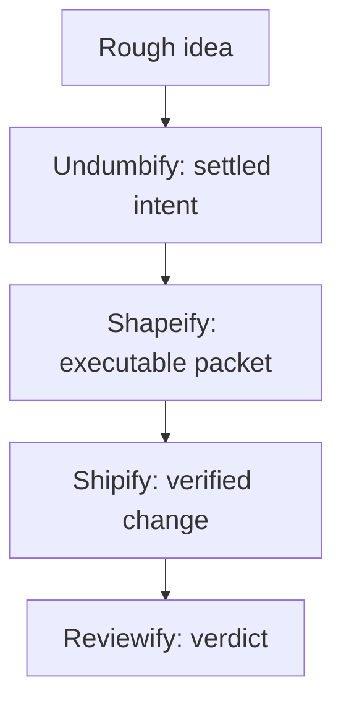

# Skillify tutorial

[← README](README.md) · [Skill catalog](README.md#skills) · [Agent guide](agents/README.md) · [Installer](README.md#installation)

> [!TIP]
> You do not need to memorize skill names, agent roles, or control labels. Describe the
> outcome normally, choose an offered approach, and continue the conversation.

This tutorial takes about 15 minutes. It starts with one ordinary request and adds the
rest of the system only when it becomes useful.

## The whole system



| Part | Meaning |
|---|---|
| **Skill** | How to do a kind of work well |
| **Agent role** | Who owns a bounded piece and what it may change |
| **Controls** | Rigor, answer length, and assumed knowledge |
| **Harness** | Codex, Claude Code, OpenCode, VS Code/Copilot, or another compatible runtime |

## 0. Install it

From this repository:

```bash
./install.sh \
  --harness codex,claude,opencode,copilot \
  --native-agents codex,claude,opencode,copilot \
  --with-agents \
  --update
```

Restart an already-open harness so it reloads its catalog. Check the installation:

```bash
./install.sh --native-agents codex,claude,opencode,copilot --status
```

> [!NOTE]
> Install only what you use. For example, `--harness codex --native-agents codex` is a
> complete Codex-only installation.

### If you use VS Code at work

Run this on that machine after cloning the repository:

```bash
./install.sh --harness vscode --native-agents copilot --with-agents --update
./install.sh --harness vscode --native-agents copilot --status
```

Then restart VS Code and perform this two-minute check:

1. Type `/skills`, or open **Chat: Open Customizations → Skills**; confirm that Orientify,
   Undumbify, Shipify, and the other Skillify skills appear.
2. Type `/agents`; confirm that **Orchestrator** appears in the agent list.
3. Keep the normal Copilot agent selected for ordinary solo requests. Select
   **Orchestrator** only when you want Team or Custom team ownership.
4. Send the request in section 1. The first response must be a 2–4 option card ending in
   Customize. No repository inspection should begin until you choose.

The nine bounded roles stay out of the dropdown on purpose. Orchestrator can invoke them
as subagents with reduced prompts and exact tool limits. Personal files live under
`~/.copilot`; project-local files live under `.github`.

## 1. Make your first natural request

Open your harness in an unfamiliar repository and write:

```text
I do not know this codebase. Show me how a login request travels through it, name the
dangerous assumptions, and do not change anything.
```

You did not name Orientify or configure a control block. The harness should recognize
read-only orientation and offer approaches similar to:

```text
How should I map login?

1. End-to-end trace (recommended) — Follow one real login path and name its traps.
   Orientify · Standard · Concise · Operational · Solo

2. Security boundary first — Start at trust boundaries, then trace the relevant path.
   Orientify · Standard · Concise · Expert · Solo

3. Quick map — Identify only the entry point, major handoffs, and tests.
   Orientify · Light · Terse · Operational · Solo

4. Customize — Choose rigor, response length, explanation, and ownership.
```

Reply with `1`, `option 1`, or a natural adjustment:

```text
1, but explain unfamiliar security terms when they appear.
```

That is the normal interaction. The compact second line is a receipt, not homework.

### The choice happens once

The root session owns the choice. After you confirm it, every child receives the same
controls, assignment boundary, and exact role map:



For example, a delegated Scout may receive:

```text
Confirmed: Orientify · Standard · Concise · Operational · Team
Boundary: locate the login entry and return exact paths only
Topology: parent coordinator → Scout (artifacts only)
```

The Scout starts that bounded assignment. It does not ask you to select Standard or Team
again. A child stops and returns to the parent only when it discovers a new material
decision outside the confirmed boundary.

## 2. Understand the controls without memorizing them

### Customize, click by click

Use this path when none of the ready-made routes has the combination you want.

**Step 1 — Choose the last entry in the first card:**

```text
4
```

`Customize` does not start work. It opens a second selector:

```text
Customize this run

Weight
W1 Light — Small, reversible work with focused verification.
W2 Standard — Normal implementation rigor and evidence.
W3 Heavy — High-risk work with recovery and stronger review.

Verbosity
V1 Terse — Outcome and critical information only.
V2 Concise — Outcome, evidence, and important deviations.
V3 Detailed — Adds reasoning, alternatives, and uncertainty.

Explanation
E1 Layman — No specialist knowledge assumed.
E2 Operational — Explain what changes actions and risks.
E3 Expert — Assume domain fluency.

Ownership
O1 Solo — One owner completes the task.
O2 Team — The harness proposes the smallest useful team.
O3 Custom team — You name the exact roles.

Current: W2 · V2 · E2 · O1
```

**Step 2 — Reply with all four choices or only the values you want to change:**

```text
W1 V2 E2 O2
```

Read that as:

| Code | Selected value | Effect |
|---|---|---|
| `W1` | Light | Focused verification for a small reversible task |
| `V2` | Concise | Short result with decisive evidence |
| `E2` | Operational | Explain information that changes action or risk |
| `O2` | Team | Propose separate owners where they add value |

Words work too: `Light, Concise, Operational, Team` means the same thing.

**Step 3 — Inspect the exact team before anyone starts:**

```text
Suggested team

Scout — read-only; locates the exact code path.
Worker — the only code writer; applies and verifies the change.

Coordinator: parent session
Orchestrator: not needed for this simple handoff

Confirm this ownership map?
```

Selecting Team does not automatically start an Orchestrator. The parent coordinates
simple routes such as `Scout → Worker` or `Planner → Worker`. A dedicated Orchestrator is
added only for substantial coordination: parallel lanes, branching handoffs, several
roles, integration ownership, or an iterative repair and review loop.

**Step 4 — Confirm or adjust the map:**

```text
Confirm
```

The harness returns a final receipt before execution:

```text
Selected: Light · Concise · Operational · Team
Team: Scout → Worker
Coordinator: parent session
```

### Choose the roles yourself

Use `O3` when you know which roles you want:

```text
W3 V1 E3 O3 roles=Scout,Worker,Reviewer
```

The harness checks that Worker is the only code writer, Reviewer remains independent,
every role has the necessary capabilities, and no unrelated role was added. It shows the
validated ownership map and waits for confirmation exactly as it does for Team.

> [!WARNING]
> Custom values tune the task; they do not grant authority. A requested Light weight
> cannot override a risk-triggered minimum, and a selected team cannot approve destructive
> work.

### You can still use normal language

Say what you mean in ordinary language:

| Say this | The harness can infer |
|---|---|
| “This touches production auth; verify deeply, but give me only the verdict.” | Heavy · Terse · Operational |
| “It is a tiny local cleanup. Keep the answer short.” | Light · Terse · Operational |
| “Walk me through it; assume I know nothing about databases.” | Appropriate weight · Detailed · Layman |
| “Give me the precise failure mode; skip introductory material.” | Appropriate weight · Concise · Expert |

- **Weight** controls rigor, recovery, and proof.
- **Verbosity** controls how much response text you receive.
- **Explanation** controls what background knowledge may be assumed.
- **Ownership** controls whether bounded roles work Solo, as a suggested Team, or as a
  user-selected Custom team.

`Heavy` does not mean verbose. `Layman` does not mean shallow or childish. Exact labels
remain available when you want them, but they are never required:

```text
Verify this as Heavy, keep the result Terse, and explain it for a Layman.
```

## 3. Take a rough feature from idea to code

Do not invoke an entire pipeline up front. Move one decision boundary at a time.

### A. Settle the idea

```text
I want login to feel faster and safer. Supply the decisions I have missed and ask only
questions whose answers can change the architecture.
```

This naturally fits **Undumbify**. After choosing an approach, you receive settled intent,
assumptions, boundaries, and only material questions.

### B. Make it executable

```text
Turn this into an implementation plan that another developer can execute without
rediscovering the codebase.
```

This fits **Shapeify**. Its packet identifies locations, checks, and traps.

### C. Implement it

```text
Implement the approved plan and verify the acceptance checks.
```

This fits **Shipify**. It owns changes, tests them, and reports deviations instead of
quietly redesigning the plan.

### D. Review it when independence matters

```text
Review the implementation against the original intent. Report only findings with an
exact location and a concrete fix.
```

This fits **Reviewify**. A separate Reviewer agent is useful when genuine independence is
worth the additional context and model usage.



> [!IMPORTANT]
> This is one useful route, not mandatory ceremony. Start at the stage you are actually
> in and stop when one method has completed the outcome.

## 4. Fix something broken

Write the symptom, not a guessed cause:

```text
Login worked yesterday. Today valid users occasionally return to the sign-in page after
MFA. Find the root cause before changing anything, then make the smallest safe repair.
```

This fits **Traceify**. It records symptoms, ranks falsifiable hypotheses, runs the
cheapest discriminating test, and names root cause before repair.

Use **Audify** instead when nothing specific is broken and you want a condition report:

```text
Audit this authentication subsystem. Establish the standard first, measure claims, and
rank findings by severity versus repair effort.
```

## 5. Learn with Teachify

Ask naturally:

```text
Teach me public-key encryption as a complete layman. I want exercises I can answer in
the page.
```

Teachify offers a lesson approach, infers the **Layman** learner level, and writes one
offline HTML page. Each auto-graded exercise provides:

- green, `✓ Correct`, and the reason for a correct answer;
- red, `✕ Not yet`, corrective feedback, and another attempt for a wrong answer;
- keyboard-accessible controls and progress that does not rely on colour alone.

Use the **Teacher** agent only when lesson creation needs isolated ownership—for example,
while another owner continues implementation. Teachify alone is enough in most sessions.

## 6. Know when agents help

Most tasks need one owner. Add roles for an ownership boundary, not for theatre.

| Situation | Smallest useful setup |
|---|---|
| One owner can inspect and finish safely | One skill, no extra agent |
| A worker needs exact locations without the full repository context | Scout → Worker |
| Settled intent needs a separately owned implementation packet | Planner → Worker |
| Review must be independent of implementation | Worker → Reviewer |
| Several bounded assignments genuinely run separately | Orchestrator + named owners |
| A long exploratory discussion must preserve decisions | Questar |
| A lesson should not occupy implementation context | Teacher |

Agent topology uses the same choice interaction:

```text
1. Solo (recommended) — One owner can finish safely with less context overhead.
2. Scout → Worker — Isolate repository reconnaissance before implementation.
3. Planner → Worker → Reviewer — Separate planning, writing, and judgment.
```

The selected role never creates permission. A Reviewer cannot edit because reviewing is
its boundary; a higher Weight cannot authorize destructive work.

## 7. Ask Skillify when you are unsure

The `skillify` skill is the built-in guide to this repository:

```text
I need to migrate a database column used by production login. Teach me the smallest safe
Skillify route, why each stage exists, and what I should say first. Do not perform it.
```

Or practise routing:

```text
Give me one realistic scenario at a time. Let me choose the skill and agent setup, then
explain the strongest choice and one tempting mismatch.
```

## 8. Verify the repository

The checks are dependency-free:

```bash
node scripts/validate-core.mjs
bash scripts/test-installer.sh
bash scripts/test-agent-adapters.sh
bash scripts/test-eval-runner.sh
bash scripts/test-token-footprint.sh
node teaching/teachify/scripts/validate-lesson.mjs teaching/teachify/assets/lesson-template.html
node scripts/test-teachify-interaction.mjs
```

Run one real behavioral case before spending tokens on a matrix:

```bash
node scripts/run-evals.mjs \
  --adapter codex \
  --installed \
  --suite orientify \
  --case orientify-login-natural-pause \
  --repeat 3 \
  --out /tmp/skillify-codex.jsonl
```

Installed natural-pause event enforcement currently supports Codex only. Claude Code and
OpenCode use the non-installed phased commands in the [adapter guide](evals/adapters/README.md).
Native evaluations use your installed authentication and may consume paid model usage.

Check prompt size without pretending bytes are exact model tokens:

```bash
node scripts/report-token-footprint.mjs --check
```

The report separates eager skill instructions from conditional references and direct
agent prompts from smaller delegated prompts.

## Pocket guide

| If you are here… | Say something like… | Likely method |
|---|---|---|
| Unknown codebase | “Trace one real flow; change nothing.” | Orientify |
| Vague feature | “Supply missing decisions.” | Undumbify |
| Settled intent | “Make an executable plan.” | Shapeify |
| Approved plan | “Implement and verify it.” | Shipify |
| Broken behavior | “Prove root cause before repair.” | Traceify |
| External decision | “Research and rank sourced findings.” | Researchify |
| No intent contract | “Audit this against an explicit standard.” | Audify |
| Finished change | “Review against original intent.” | Reviewify |
| Learning | “Teach me at this level with exercises.” | Teachify |
| Unsure about routing | “Teach me the smallest Skillify route.” | Skillify |

## You are ready when…

You can start with the outcome instead of a framework incantation:

```text
Here is what I want, here is what I know, and here is what must not change. Offer me the
meaningful ways to proceed.
```

The harness should do the routing. You only choose the trade-off you actually care about.
