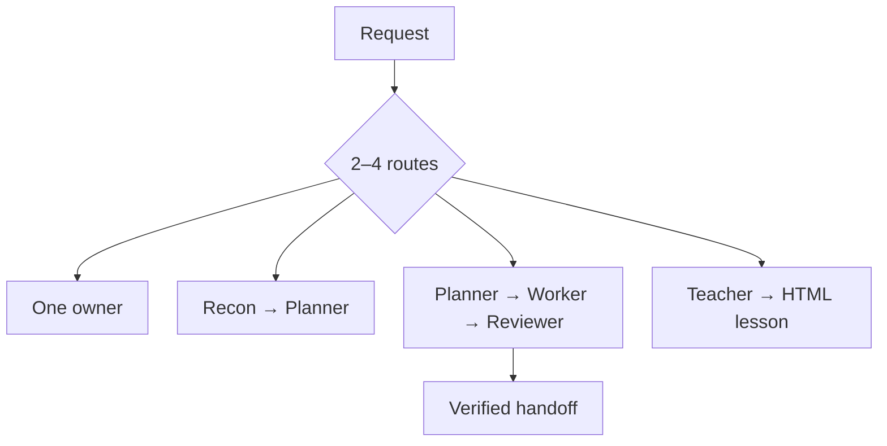
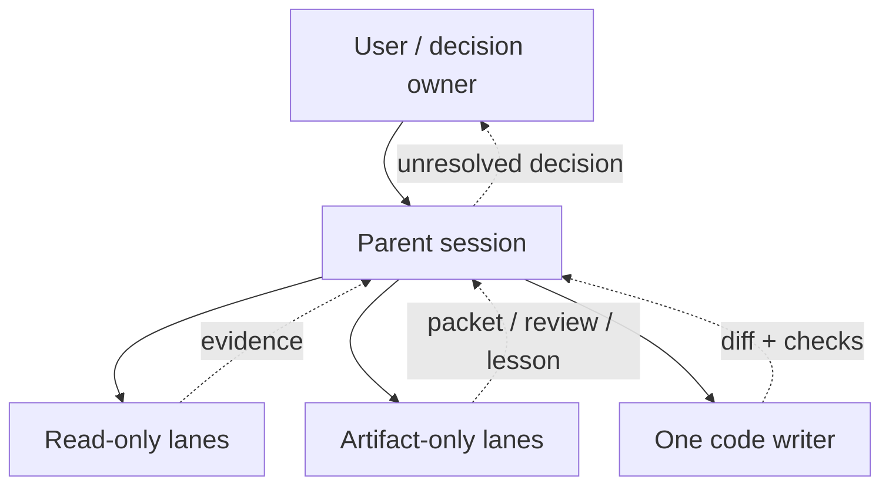

# Agents — harness-neutral roles

[← Repository guide](../README.md) · [Hands-on tutorial](../TUTORIAL.md) · [Manifest](manifest.json) · [Selection contract](contracts/selection.md) · [Fleet evals](../evals/agents/cases.json)

> **Skills own methods. Roles own authority. Adapters own native tools.**

The fleet contains ten portable roles. A role says what an owner may do, which skill
methods it uses, which capabilities it requires, and what its handoff must prove. Model
selection and native syntax stay outside these source contracts.

## Selection before dispatch

For substantial work, the parent presents two to four concrete routes and waits for the
user's choice. The recommendation comes first.



The choice card shows plain impact first and compact controls second. It never grants
mutation authority. A tiny reversible task may use a one-line selection receipt and
continue.

## Shared controls

| Axis | Values | Controls |
|---|---|---|
| Weight | Light · Standard · Heavy | Rigor, recovery, evidence, topology |
| Verbosity | Terse · Concise · Detailed | User-facing output length |
| Explanation | Layman · Operational · Expert | Assumed subject knowledge |

Heavy work can remain Terse. Layman output can still use Heavy proof. These axes are
independent and carried unchanged through handoffs.

## Active roles

| Group | Role | Purpose | Mutability | Method skills |
|---|---|---|---|---|
| Oversight | [Orchestrator](guides/orchestrator/README.md) | Selects the smallest topology and verifies handoffs | artifacts-only | — |
| Oversight | [Oracle](guides/oracle/README.md) | Checks decision consistency on clean context | read-only | — |
| Session | [Questar](guides/questar/README.md) | Preserves a long exploration until intent settles | artifacts-only | orientify, researchify, undumbify, shapeify, teachify |
| Recon | [Scout](guides/scout/README.md) | Returns fast, exact code locations | artifacts-only | orientify |
| Recon | [Context Builder](guides/context-builder/README.md) | Produces a no-rediscovery context pack | artifacts-only | undumbify, researchify |
| Recon | [Researcher](guides/researcher/README.md) | Returns focused current external evidence | artifacts-only | researchify |
| Pipeline | [Planner](guides/planner/README.md) | Produces an executable worker packet | artifacts-only | undumbify, shapeify |
| Pipeline | [Worker](guides/worker/README.md) | Owns the single product-code writer lane | code | shipify, traceify |
| Pipeline | [Reviewer](guides/reviewer/README.md) | Judges work against intent without rewriting it | artifacts-only | reviewify, audify |
| Teaching | [Teacher](guides/teacher/README.md) | Builds an interactive HTML lesson | artifacts-only | teachify, researchify |

## Authority model



- `read-only`: no product or artifact writes.
- `artifacts-only`: only the role's declared report, packet, dossier, review, or lesson.
- `code`: product-file changes inside the approved boundary.

Only Worker has `code` mutability. The validator rejects a broader manifest.

> [!WARNING]
> A role name never creates permission. The runtime must enforce the manifest as tightly
> as it can, and decisions remain with the user or named decision owner.

## Runtime adapter contract

A native adapter must:

1. compose every global contract;
2. add the role-specific contracts;
3. add the selected role file;
4. make required capabilities available or fail before dispatch;
5. load the role's method skills;
6. enforce mutability;
7. carry selection, weight, verbosity, and explanation through every handoff;
8. return unresolved decisions to the parent or user.

Generate supported adapters without choosing models:

```bash
./install.sh --native-agents codex,claude,opencode --update
```

The generator stores hashes in `.skillify-native.json`, refuses unmanaged collisions,
checks freshness, and removes stale managed definitions.

## Writer topology

At most one role writes product code in one working directory. Parallel writers require
isolated working directories and one named integration owner. Read-only lanes may inspect
the same revision.

Stop on a writer collision, ambiguous dirty-state ownership, or evidence belonging to a
different revision.

## Handoff minimum

Every delegated result contains:

- assigned outcome and boundary;
- completed, partial, or blocked status;
- artifacts or exact evidence locations;
- checks actually performed and their observed results;
- disproved assumptions, deviations, and residual risks;
- unresolved decisions and the next valid owner.

Raw internal narration and unsupported success claims are not handoffs.

## Plain language

The communication contract uses pragmatic Simplified Technical English: active voice,
concrete subjects, stable terms, conditions before commands, and no filler or ceremonial
orchestration prose. Strict ASD-STE100 rules apply only when explicitly requested.

## Add or change a role

1. Add the portable role under `roles/<group>/<name>.md`.
2. Add its manifest entry, capabilities, mutability, contracts, and method skills.
3. Add a guide with a meaningful Mermaid diagram.
4. Add selection, authority, boundary, and handoff cases where relevant.
5. Run native adapter generation in an isolated directory and check it.
6. Run `node scripts/validate-core.mjs` from the repository root.

No credentials, model identifiers, vendor commands, or local authentication settings
belong in a portable role.
