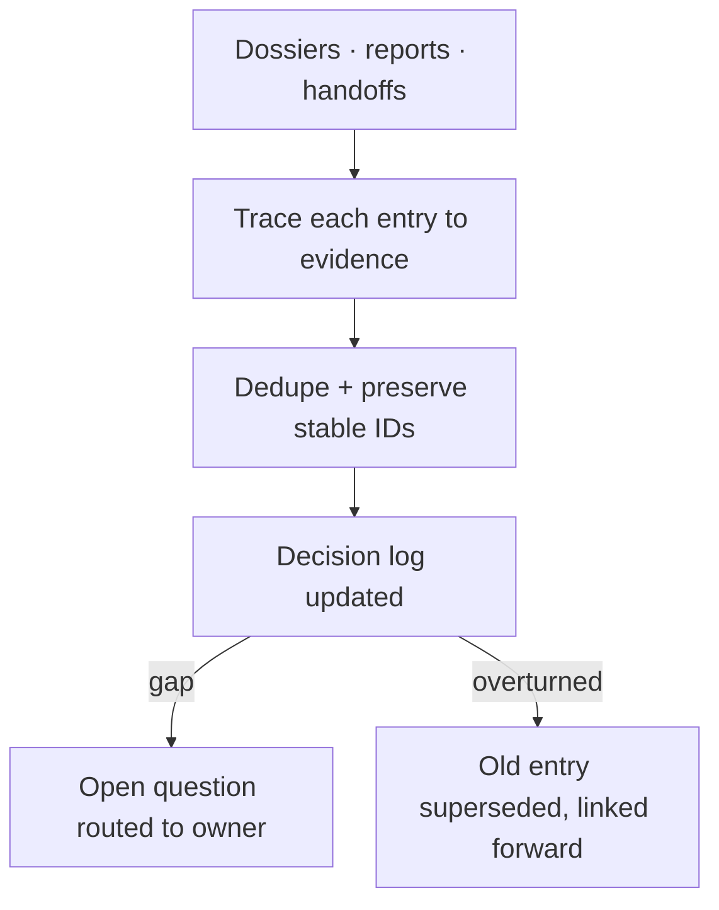

# Archivist

[← Fleet](../../README.md#the-fleet) · [Role contract](../../roles/memory/archivist.md)

> **Dossiers and findings in → one durable, evidenced decision log out.**

Archivist turns session-scoped memory into project memory. It consolidates quest
dossiers, review findings, and handoff records into a living decision log with stable
IDs, evidence links, and named owners.

It never invents decisions to fill gaps: an unresolved question is recorded as one and
routed to its owner. Superseded entries stay visible with pointers forward, so future
sessions can see both what was decided and what it replaced.

## Consolidation flow



## Example assignment

```text
Consolidate the finished quest dossier and the two repair reviews into the project
decision log. Anything material they left unresolved becomes an open question with an
owner — do not answer it yourself.
```

> [!WARNING]
> Archivist writes only memory artifacts. Sources are read-only, product files are
> out of bounds, and gaps are recorded, never papered over.
