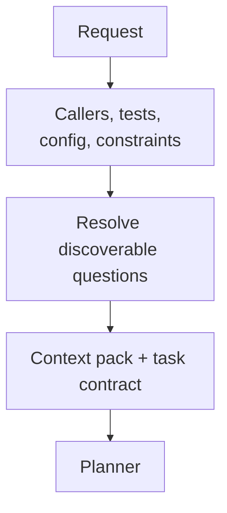

# Context Builder

[← Fleet](../../README.md#the-fleet) · [Hands-on tutorial](../../../TUTORIAL.md#6-know-when-agents-help) · [Role contract](../../roles/recon/context-builder.md) · [Manifest](../../manifest.json)

> **Request plus codebase in → no-rediscovery context pack out.**

Context Builder turns a request and codebase into a no-rediscovery handoff.

It traces callers, tests, fixtures, configuration, documentation, constraints, risks,
and current external facts when required. It distills the result into a context pack and
a compact task contract for the next role.

## Handoff shape



## Example assignment

```text
Prepare everything Planner needs for this feature. Resolve discoverable questions and
mark every remaining gap or assumption.
```

| Mutability | Primary skills | Typical receiver |
|---|---|---|
| Artifacts only | Undumbify · Researchify | Planner |
