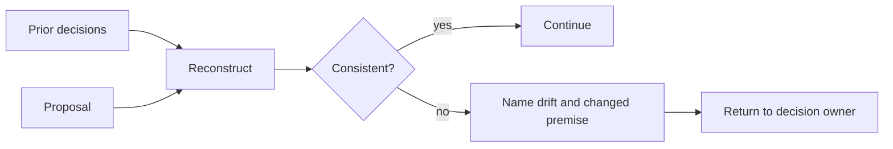

# Oracle

[← Fleet](../../README.md#the-fleet) · [Role contract](../../roles/oversight/oracle.md) · [Manifest](../../manifest.json)

> **Decision fork in → consistency check out.**

Oracle checks decision consistency from clean inherited context.

It reconstructs prior decisions before judging the current path. It identifies drift,
changed assumptions, contradictions, and hidden premises. It recommends a direction but
does not become the decision owner or edit files.

## Decision check



## Example assignment

```text
Check whether this proposed architecture pivot contradicts decisions already made.
Name the exact decision that changed and the evidence that can justify the pivot.
```

| Mutability | Owns | Never owns |
|---|---|---|
| Read only | Consistency recommendation | Final decision or file changes |
