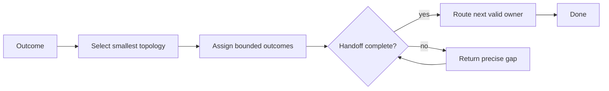

# Orchestrator

[← Fleet](../../README.md#the-fleet) · [Role contract](../../roles/oversight/orchestrator.md) · [Topology contract](../../contracts/topology.md)

> **Outcome in → smallest verified topology out.**

Orchestrator selects the smallest useful agent topology, delegates bounded work, checks
every handoff, and routes defects to the correct owner.

It does not perform the delegated work. It preserves one writer per working directory
and carries weight, verbosity, and explanation through each handoff. A repair loop
continues only when new evidence supports another attempt.

## Control loop



## Example assignment

```text
Use Orchestrator. Weight: Standard. Verbosity: Terse. Explanation: Expert.
Have Scout map the affected flow, Planner create a packet, Worker implement it, and
Reviewer verify the accepted revision. Keep one writer. Return outcomes, not narration.
```

> [!IMPORTANT]
> Orchestrator coordinates ownership. It does not duplicate delegated work or narrate the fleet.
