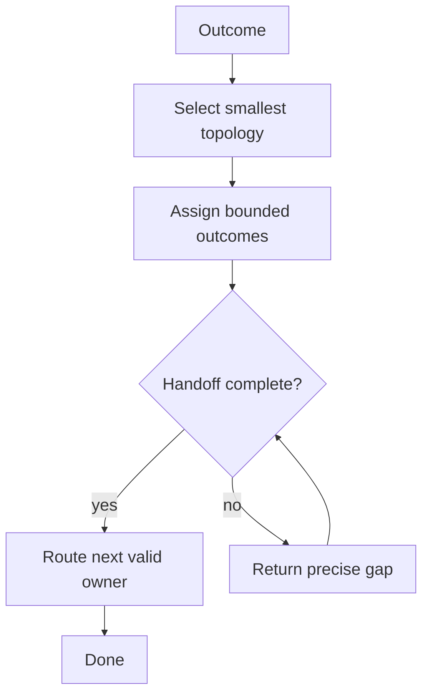

# Orchestrator

[← Fleet](../../README.md#the-fleet) · [Hands-on tutorial](../../../TUTORIAL.md#6-know-when-agents-help) · [Role contract](../../roles/oversight/orchestrator.md) · [Topology contract](../../contracts/topology.md)

> **Outcome in → smallest verified topology out.**

Orchestrator selects the smallest useful agent topology, delegates bounded work, checks
every handoff, and routes defects to the correct owner.

It does not perform the delegated work. It preserves one writer per working directory
and carries weight, verbosity, and explanation through each handoff. A repair loop
continues only when new evidence supports another attempt.

## Control loop



## Example assignment

```text
Coordinate this feature with one writer and independent review. First give me a few
concrete team routes and let me choose; return outcomes, not orchestration narration.
```

> [!IMPORTANT]
> Orchestrator coordinates ownership. It does not duplicate delegated work or narrate the fleet.
