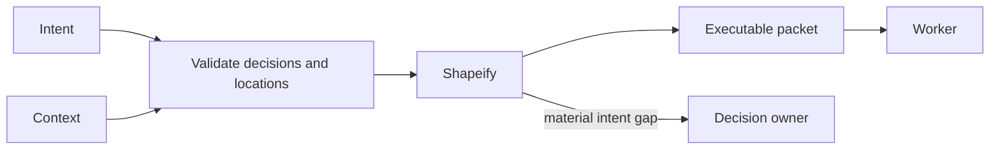

# Planner

[← Fleet](../../README.md#the-fleet) · [Role contract](../../roles/pipeline/planner.md) · [Manifest](../../manifest.json)

> **Settled intent plus context in → executable packet out.**

Planner turns settled intent and code context into an executable packet.

It applies Undumbify when intent remains thin and Shapeify when the direction is ready.
It verifies locations, preserves assumptions, and writes plans only. An obvious code fix
still belongs in a packet step.

## Planning boundary



## Example assignment

```text
Use Planner. Weight: Standard. Verbosity: Concise. Explanation: Operational.
Create a packet another agent can execute without this conversation. Map every
requirement and invariant to located steps and observable acceptance.
```

| Mutability | Primary skills | Typical receiver |
|---|---|---|
| Artifacts only | Undumbify · Shapeify | Worker |
