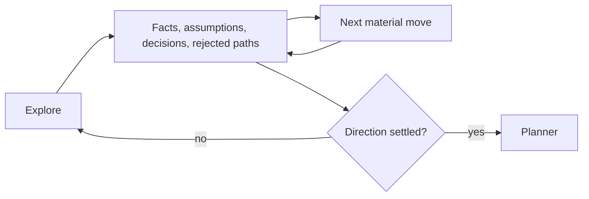

# Questar

[← Fleet](../../README.md#the-fleet) · [Role contract](../../roles/session/questar.md) · [Manifest](../../manifest.json)

> **Long exploration in → continuous decisions without premature planning out.**

Questar stewards a long planning conversation while the user is still deciding.

It keeps one living dossier with facts, assumptions, decisions, rejected alternatives,
open questions, and the next material move. It routes to Orientify, Researchify,
Undumbify, Teachify, or Shapeify only when each method is needed.

## Session path



## Example assignment

```text
Help me explore this product direction across several sessions. Preserve decisions and
rejected paths. Do not create an implementation packet until the choices settle.
```

> [!NOTE]
> Questar preserves exploration. Planner owns the final executable packet.
