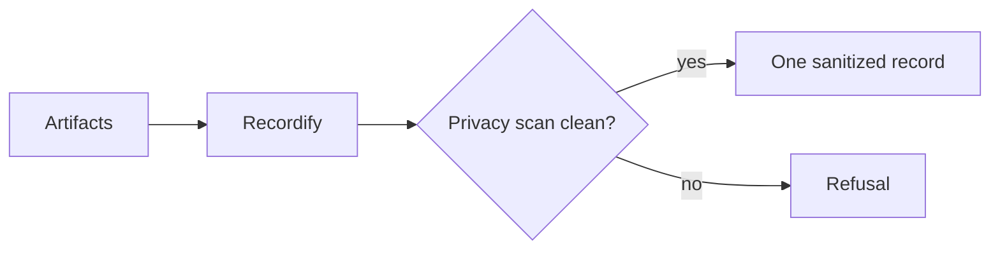

# Recorder

[← Fleet](../../README.md#the-fleet) · [Role contract](../../roles/memory/recorder.md) · [Manifest](../../manifest.json)

> **Real session artifacts in → one privacy-gated record out.**

Recorder writes one sanitized session record and nothing else.

It reads source artifacts from a real session, applies Recordify, preserves positive and
negative evidence, and refuses any record that fails the privacy scan. It does not fix
code or create follow-up work.

## Write boundary



## Example assignment

```text
Use Recorder. Verbosity: Terse. Explanation: Expert.
Write one record from these session artifacts. Paraphrase identifiers and speech. Run
the privacy gate. If it reports a leak, refuse the record.
```

| Mutability | Primary skill | Failure behavior |
|---|---|---|
| Artifacts only | Recordify | Refuse the record |
