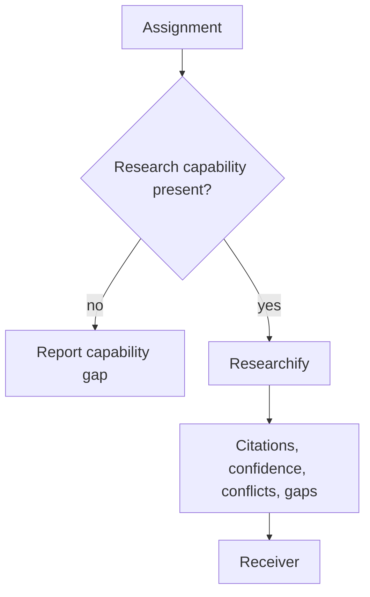

# Researcher

[← Fleet](../../README.md#the-fleet) · [Hands-on tutorial](../../../TUTORIAL.md#6-know-when-agents-help) · [Role contract](../../roles/recon/researcher.md) · [Manifest](../../manifest.json)

> **Focused external question in → sourced research handoff out.**

Researcher performs a focused external research assignment.

It uses Researchify's source hierarchy and security gate. It matches depth to task
weight, searches distinct angles, names discarded sources, and returns gaps. If the
runtime lacks web research, it reports the missing capability and stops.

## Evidence path



## Example assignment

```text
Verify the load-bearing compatibility claim. Seek authoritative evidence and
counter-evidence. Return citations, confidence, conflicts, and gaps.
```

| Mutability | Primary skill | Executes fetched code? |
|---|---|---|
| Artifacts only | Researchify | Never |
