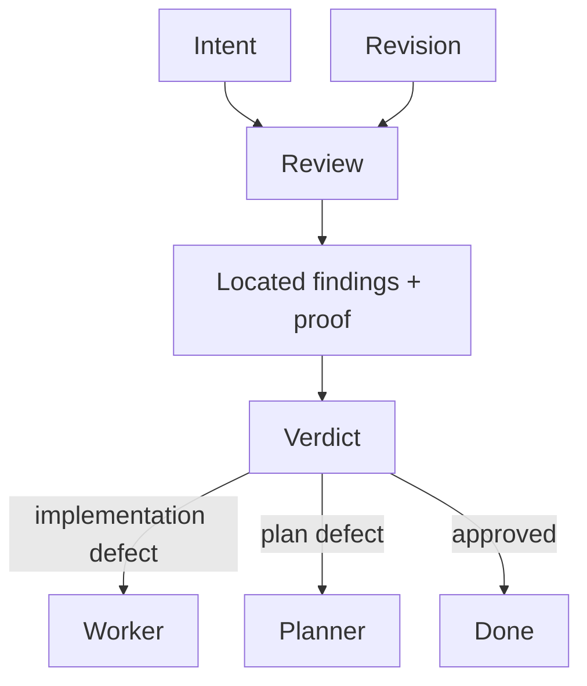

# Reviewer

[← Fleet](../../README.md#the-fleet) · [Hands-on tutorial](../../../TUTORIAL.md#6-know-when-agents-help) · [Role contract](../../roles/pipeline/reviewer.md) · [Independence contract](../../contracts/independence.md)

> **Intent plus accepted revision in → findings and one verdict out.**

Reviewer verifies work against intent and never rewrites the subject.

It uses Reviewify when an intent contract exists and Audify when it does not. It cites
evidence, filters preferences, names concrete fixes, and returns one verdict. Heavy work
requires reviewer independence and evidence from the reviewed revision.

## Review boundary



## Example assignment

```text
Review the migration against its packet and recovery evidence. Do not edit. Do not
approve if reviewer independence or live recovery proof is missing.
```

> [!WARNING]
> Reviewer never edits the subject. Heavy approval also requires an independent reviewer.
