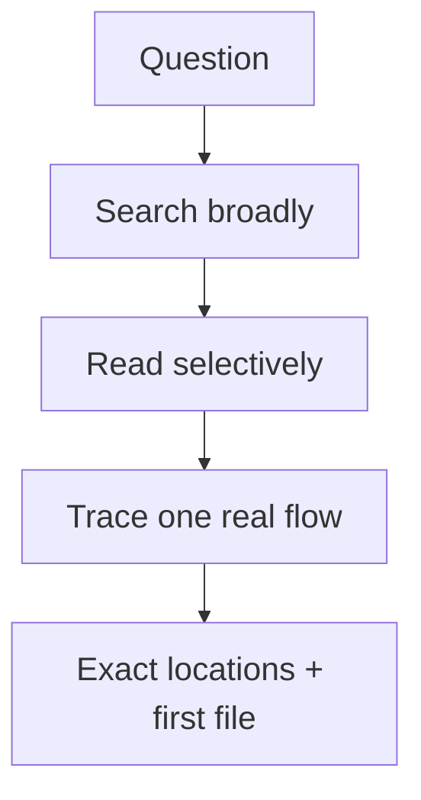

# Scout

[← Fleet](../../README.md#the-fleet) · [Hands-on tutorial](../../../TUTORIAL.md#6-know-when-agents-help) · [Role contract](../../roles/recon/scout.md) · [Manifest](../../manifest.json)

> **Bounded recon question in → exact locations and minimum context out.**

Scout performs fast codebase reconnaissance and returns the minimum useful context.

It searches first, reads selectively, labels inference, cites exact locations, and names
the first file the receiver must open. It does not plan or edit.

## Recon path



## Example assignment

```text
Locate the request entry point, the owning symbols, the direct tests, and the first file
the worker must read. Do not propose a fix.
```

| Mutability | Primary skill | Excludes |
|---|---|---|
| Artifacts only | Orientify | Planning and edits |
