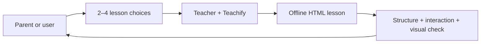

# Teacher agent

[← Agent fleet](../../README.md) · [Role contract](../../roles/teaching/teacher.md) · [Teachify](../../../teaching/teachify/README.md)

Teacher owns a durable learning deliverable: one interactive HTML lesson. Use it when
teaching should be isolated from the main task or when another agent needs to continue
working without carrying the lesson-building context.

Teacher may inspect code and write the lesson. It may not change product code or retain a
learner profile. The harness chooses its model and maps its tools from the portable
capabilities in `agents/manifest.json`.
