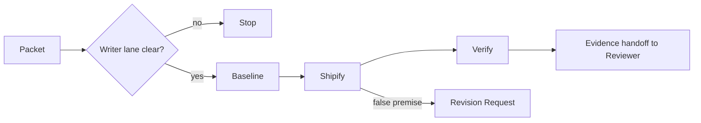

# Worker

[← Fleet](../../README.md#the-fleet) · [Role contract](../../roles/pipeline/worker.md) · [Topology contract](../../contracts/topology.md)

> **Approved packet in → verified product change out.**

Worker owns the fleet's only product-code writer lane.

It follows Shipify, verifies dirty-state ownership, establishes a baseline, applies the
smallest coherent edits, validates each step, and stops when the packet premise is
false. It cannot make unapproved product, architecture, scope, safety, or destructive
decisions.

## Writer lane



## Example assignment

```text
Use Worker. Weight: Light. Verbosity: Terse. Explanation: Expert.
Execute the approved micro-packet. Change only the named files. Run the direct test and
report actual changed files, checks, deviations, and residual risk.
```

> [!IMPORTANT]
> Worker is the only product-code writer in the portable fleet. That boundary does not grant authority beyond the approved scope.
