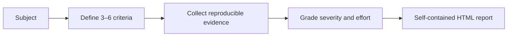

# Audify

[← All skills](../../README.md#skills) · [Runtime contract](SKILL.md) · [Behavior cases](../../evals/audify/cases.json)

> **Contract-free subject in → measurable condition report out.**

Audify evaluates a subject that has no written intent contract.

## Use it for

- Repository or configuration health.
- A discussion or plan with unclear decisions.
- A running system that needs an evidence-based condition report.

Audify defines three to six criteria before deep inspection. Each finding needs a
reproducible observation, provenance, severity, effort, location, and first action. The
final artifact is a self-contained HTML report with no runtime network dependency.

## Flow



## Example

```text
Audit this repository for maintainability, verification quality, portability, and
security boundaries. Let me choose the audit scope before the deep pass.
```

> [!TIP]
> Use Reviewify instead when a packet already defines intent.
