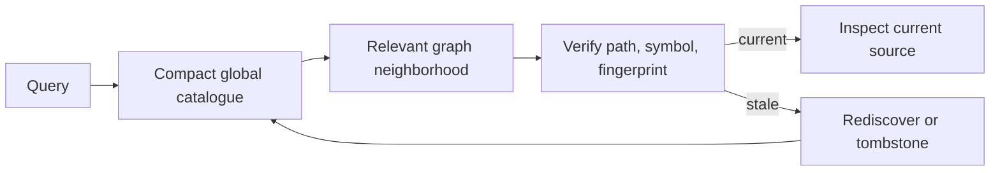

# Mapify

[← All skills](../../README.md#skills) · [Hands-on tutorial](../../TUTORIAL.md) · [Runtime contract](SKILL.md) · [Behavior cases](../../evals/mapify/cases.json)

> **Expensive discovery in → sparse verified pointers out.**

Mapify preserves expensive-to-rediscover codebase knowledge as sparse Markdown nodes
and a disposable cross-repository catalogue. It points agents toward likely source while
requiring current-code verification before use.

Use it after expensive multi-file discovery, for repeated cross-repository lookup, or
when history and replacement relationships matter. A direct path, one known symbol, or
one obvious edge is normally cheaper to inspect with source search. Mapify is not a
source-code backup, complete repository index, or replacement for Orientify.

Open [`assets/graph-viewer.html`](assets/graph-viewer.html) for a self-contained visual
example. It starts with dummy cinema nodes and can load the helper's generated
`catalog.json` without a server or external dependency.

## Retrieval loop



## Example

```text
Find the current and replaced TitleSheet implementations across mapped repositories,
verify the relevant pointers, then inspect only the source needed to confirm their flow.
```

> [!TIP]
> If the user already supplied an exact path, open it directly. Mapify is useful only
> when it narrows discovery or preserves knowledge expensive enough to reuse.

`verify` reports `edges-linked` when referenced nodes exist. This is intentionally not
`edges-proven`: open targeted source at both endpoints before presenting a saved
relationship as current behavior.

For a warm lookup, use one exact catalogue query, verify only the chosen IDs, and open
only source slices needed by the answer. Generated indexes and views are for human graph
browsing, not mandatory lookup context.

After an expensive discovery, `propose` can validate and print one sparse deposit
candidate without writing anything. Persist it only when Mapify artifact writes are
already authorized.

## Observed lookup runs

These September 2026 runs searched the same two current/legacy `TitleSheet.tsx` targets.
They are practical observations, not model benchmarks; the first trial included map
creation and different route weights. Token counts are runtime-reported.

| Runtime and trial | Cold input / output / thinking | Warm input / output / thinking | Source lines, cold → warm | Observation |
|---|---:|---:|---:|---|
| Gemini 3.8 Flash High, exploratory | 374.8K / 18.8K / 13.7K | 96.1K / 6.0K / 4.7K | ~890 → ~150 | 74% less input; cold run also created the map |
| Gemini 3.8 Flash High, controlled retry | 165.6K / 4.6K / 2.4K | 126.8K / 5.0K / 3.4K | ~1,707 → ~245 | 23% less input and 86% fewer source lines |
| GPT-5.6 Luna, independent check | Not exposed | Not exposed | ~1,200 → ~700 | 42% fewer source lines; route labels and timing were not controlled |

A pre-hardening Gemini warm attempt consumed 392.5K input tokens after loading the
entire generated map, unrelated workflow skills, and a redundant global search. It is
excluded from the successful comparison; the failure produced Mapify's bounded warm
lookup fast path and regression case.

### Haiku-class trial, three paired questions (first description)

These runs used the skill description in force at the time, which ended on a negative
trigger telling the agent to prefer direct source search. See the next section for what
changed when that ending was rewritten.

A later run used a small, fast model against a private two-app TypeScript
monorepo of 56 source files that none of the agents had seen. Three questions were
asked in one pass: a multi-hop flow trace crossing both apps, a single-constant
lookup, and a test-to-source invariant. Every agent was told to report the files it
opened, the source lines it read, and its tool calls. Answers were graded against a
chain established independently beforehand.

| Condition | Source lines | Files | Tool calls | Answer quality |
|---|---:|---:|---:|---|
| Cold, direct search only | 1,880 | 9 | 18 | all three correct |
| Map offered, agent chose not to use it | 1,376 | 8 | 14 | **flow trace incomplete — missed the entire browser half of the chain** |
| Map required | 1,607 | 8 | 22 | all three correct, most complete chain, and it named the files the map did not cover |

Two results matter more than the percentages.

**The map was not invoked when it was merely available.** The middle agent had the
skill, the catalogue, and the helper path, and still reported using direct search
because it judged that cheaper — including for the multi-hop trace that is Mapify's
stated best case. An unused map is not a neutral outcome: that run produced the
weakest answer of the three while looking like the cheapest.

**Cost alone would have selected the worst answer.** The lowest source-line count
belongs to the run that silently dropped half the flow. Any comparison of Mapify
against direct search has to grade correctness, or it rewards the agent that stopped
early.

Forced use read 15% fewer source lines and consumed 16% fewer runtime tokens than
cold, but made 22% more tool calls, because `find` and `verify` cost turns before any
source is opened. On a chain this short that overhead is most of the saving. The
defensible claim from this trial is about completeness, not speed.

### How to read all of these numbers

Each condition above is a single run, and the earlier trials show cold baselines for
the same task varying by more than a factor of two. Differences smaller than that
spread are not evidence of an effect. Source lines read is the most comparable column,
because runtime token counts include map creation, skill loading, and routing that
differ between conditions. Treat every figure here as an observation that motivated a
regression case, not as a benchmark.

### Rewriting the description's ending, three repeats

The first trial's most useful result was that the map went unused when merely offered.
One hypothesis was the description itself: it ended on a negative trigger telling the
agent to prefer direct source search, and every sibling skill in this repository instead
ends on a positive `Use when …` clause. The description was rewritten to match that
house style — the negative moved to a subordinate mid-sentence clause, the ending states
when the skill applies.

The same offered condition was then run three times against the same repository, with
the prompt reused verbatim so the description was the only changed variable.

| Run | Used the map? | Source lines | Files | Tool calls | Flow-trace answer |
|---|---|---:|---:|---:|---|
| Previous description | no | 1,376 | 8 | 14 | incomplete |
| A | yes, all three questions | 1,423 | 10 | 25 | complete |
| B | yes | 778 | 8 | 20 | **incomplete — stopped where the map stopped** |
| C | no | 2,397 | 13 | 28 | complete, and the most thorough of any run |

Invocation moved from none to two of three. That is movement, not proof: four runs of
one small model cannot separate a real effect from ordinary variance, and run C shows
the description alone does not settle the decision.

**Map use did not predict a correct answer.** Run B was the cheapest of every run
recorded here — less than half the source lines of any other — and gave the worst
answer. It followed the map's edges from the first indexed node and stopped there, so
the one file the map did not index dropped silently out of its chain. Run A used the map
for the same question, then traced past it into unindexed source, and got the chain
right. Run C ignored the map, paid three times B's reading cost, and was the most
complete.

The map was deliberately left sparse for these runs, and no node was added after seeing
any result. That sparseness is the point: a map is always incomplete, and B is what
inheriting its blind spot looks like from the outside — a confident, cheap, wrong-shaped
answer. It is the failure this skill's own contract exists to prevent, reproduced under
the fixed description, and it argues that the retrieval guidance matters more than the
invocation trigger.

Across all seven runs recorded in both sections, the two single-fact questions were
answered correctly every time, by every condition. Only the multi-hop trace separated
them. Cheap lookups are not where a map decides anything.
