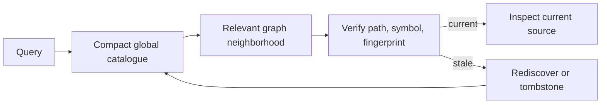

# Mapify

[← All skills](../../README.md#skills) · [Hands-on tutorial](../../TUTORIAL.md) · [Runtime contract](SKILL.md) · [Behavior cases](../../evals/mapify/cases.json)

> **Expensive discovery in → sparse verified pointers out.**

Mapify preserves expensive-to-rediscover codebase knowledge as sparse Markdown nodes
and a disposable cross-repository catalogue. It points agents toward likely source while
requiring current-code verification before use.

Use it after expensive multi-file discovery, for repeated cross-repository lookup, or
when history and replacement relationships matter. A direct path, one known symbol, or
one obvious edge is normally cheaper to inspect with source search. Mapify is not a
source-code backup, complete repository index, or replacement for Orientify.

Open [`assets/graph-viewer.html`](assets/graph-viewer.html) for a self-contained visual
example. It starts with dummy cinema nodes and can load the helper's generated
`catalog.json` without a server or external dependency.

## Retrieval loop



## Example

```text
Find the current and replaced TitleSheet implementations across mapped repositories,
verify the relevant pointers, then inspect only the source needed to confirm their flow.
```

> [!TIP]
> If the user already supplied an exact path, open it directly. Mapify is useful only
> when it narrows discovery or preserves knowledge expensive enough to reuse.

`verify` reports `edges-linked` when referenced nodes exist. This is intentionally not
`edges-proven`: open targeted source at both endpoints before presenting a saved
relationship as current behavior.

For a warm lookup, use one exact catalogue query, verify only the chosen IDs, and open
only source slices needed by the answer. Generated indexes and views are for human graph
browsing, not mandatory lookup context.

After an expensive discovery, `propose` can validate and print one sparse deposit
candidate without writing anything. Persist it only when Mapify artifact writes are
already authorized.

## Observed lookup runs

These September 2026 runs searched the same two current/legacy `TitleSheet.tsx` targets.
They are practical observations, not model benchmarks; the first trial included map
creation and different route weights. Token counts are runtime-reported.

| Runtime and trial | Cold input / output / thinking | Warm input / output / thinking | Source lines, cold → warm | Observation |
|---|---:|---:|---:|---|
| Gemini 3.8 Flash High, exploratory | 374.8K / 18.8K / 13.7K | 96.1K / 6.0K / 4.7K | ~890 → ~150 | 74% less input; cold run also created the map |
| Gemini 3.8 Flash High, controlled retry | 165.6K / 4.6K / 2.4K | 126.8K / 5.0K / 3.4K | ~1,707 → ~245 | 23% less input and 86% fewer source lines |
| GPT-5.6 Luna, independent check | Not exposed | Not exposed | ~1,200 → ~700 | 42% fewer source lines; route labels and timing were not controlled |

A pre-hardening Gemini warm attempt consumed 392.5K input tokens after loading the
entire generated map, unrelated workflow skills, and a redundant global search. It is
excluded from the successful comparison; the failure produced Mapify's bounded warm
lookup fast path and regression case.
