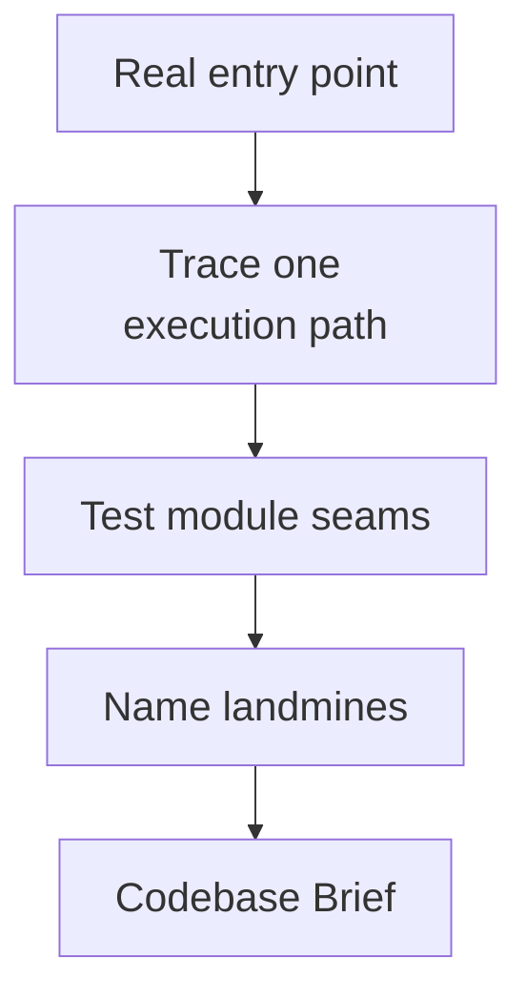

# Orientify

[← All skills](../../README.md#skills) · [Hands-on tutorial](../../TUTORIAL.md) · [Runtime contract](SKILL.md) · [Behavior cases](../../evals/orientify/cases.json)

> **Unknown codebase in → evidence-backed map out. No edits.**

Orientify builds a trustworthy codebase map before planning or editing starts.

## Use it when

- You inherited an unfamiliar repository.
- You returned after a long gap.
- A decision depends on understanding one real execution flow.

It traces an entry-to-exit path, tests module seams with the deletion test, and names
landmines. It does not fix them.

## Output

Small repositories receive a short orientation. Larger repositories receive a Codebase
Brief with vocabulary, architecture, hot spots, seams, landmines, open questions, and
the traced flow that supports the map.

## Flow



## Example

```text
Trace the main request flow and identify the first file a new developer must read.
Do not edit anything.
```

> [!NOTE]
> The map records uncertainty explicitly. It does not hide inference as fact.
