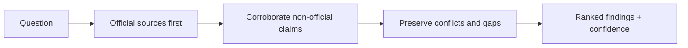

# Researchify

[← All skills](../../README.md#skills) · [Runtime contract](SKILL.md) · [Behavior cases](../../evals/researchify/cases.json)

> **Decision question in → ranked, sourced findings out.**

Researchify produces sourced findings for decisions that depend on external facts.

## Method

It starts with official sources, uses popularity only as a tiebreaker, requires two
independent sources for non-official findings, preserves disagreements, and labels
confidence. It never executes fetched code.

Use a quick lookup for one narrow question. Use a full brief for multiple angles,
conflicting sources, or a durable handoff.

## Source ladder



## Example

```text
Research whether this dependency is suitable for a production service. Rank the
findings, cite sources, and name unresolved security or maintenance risks.
```

> [!WARNING]
> Research informs a decision. It does not silently make one or execute fetched code.
