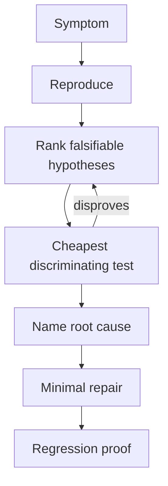

# Traceify

[← All skills](../../README.md#skills) · [Hands-on tutorial](../../TUTORIAL.md) · [Runtime contract](SKILL.md) · [Behavior cases](../../evals/traceify/cases.json)

> **Symptom in → proven root cause and guarded repair out.**

Traceify diagnoses broken behavior before it changes code.

## Use it when

- A test, request, job, or service fails.
- A regression appeared recently.
- A failure is intermittent or difficult to reproduce.

It captures symptoms, ranks falsifiable hypotheses, runs the cheapest discriminating
test, names the root cause, applies a minimal fix when the change is trivial, and proves
the original trigger no longer fails. Non-trivial fixes route to the delivery pipeline.

## Repair loop



## Example

```text
This timeout started yesterday and occurs intermittently. Reproduce it, name the root
cause before editing, and add a regression guard if the fix is trivial.
```

> [!TIP]
> Do not use Traceify for healthy feature work; route decision-ready changes to Shipify.
