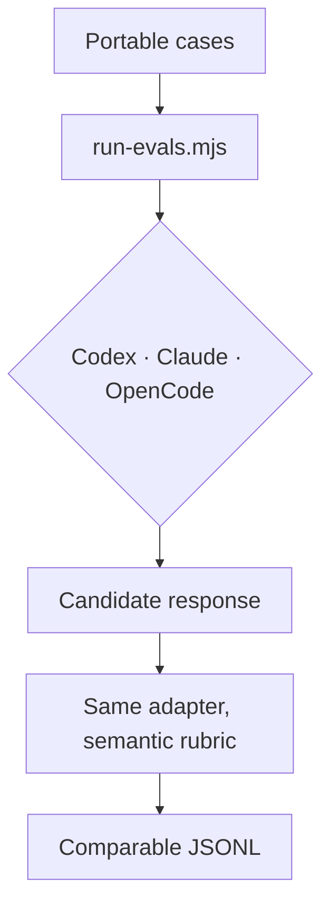

# Evaluation adapters

`scripts/run-evals.mjs` executes the same portable cases through Codex, Claude Code, or
OpenCode. The repository does not select a model. Pass `--model` when you need a fixed
comparison, or omit it to use the harness default.



## Safe first run

The fixture adapter tests the runner without calling a model:

```bash
node scripts/run-evals.mjs --adapter fixture --suite all --out /tmp/skillify-fixture.jsonl
```

Run one real case before starting a matrix:

```bash
node scripts/run-evals.mjs --adapter codex --suite teachify --limit 1 --out /tmp/codex.jsonl
node scripts/run-evals.mjs --adapter claude --suite teachify --limit 1 --out /tmp/claude.jsonl
node scripts/run-evals.mjs --adapter opencode --suite teachify --limit 1 --out /tmp/opencode.jsonl
```

Target one exact behavior while iterating:

```bash
node scripts/run-evals.mjs --adapter codex --suite skillify \
  --case skillify-custom-controls-team --out /tmp/custom.jsonl
```

Each native run uses the installed harness's authentication and may consume paid model
usage. The runner keeps the evaluated session read-only, but the grader is another model
call. Use `--repeat` only after the one-case run succeeds.

Cases with `customization` exercise the complete conversation: initial route card,
second-stage four-axis selector, exact team proposal when applicable, ownership
confirmation, execution response, and semantic grading.

Cases marked `naturalPause` also support an installed/native path:

```bash
node scripts/run-evals.mjs --adapter codex --installed --suite orientify \
  --case orientify-login-natural-pause --repeat 3
```

Unlike phased card-quality tests, this sends only the original user request through the
installed instructions. The Codex adapter inspects JSON events and rejects subject tools
before selection. It permits the required read of the activated `SKILL.md`. Ensure the
candidate revision is installed or linked before comparing revisions; the JSONL records
whether input came from `contract` or `installed` mode.

Compare two runs made with the same adapter, model, and repetition count:

```bash
node scripts/compare-evals.mjs baseline.jsonl candidate.jsonl
```

The comparison fails when a previously passing case regresses. JSONL keeps the actual
transcript and grader evidence so a human can inspect disagreements instead of trusting a
single percentage.
