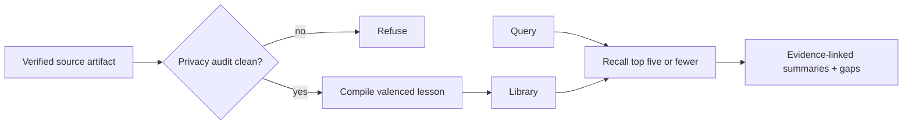

# Librify

[← All skills](../../README.md#skills) · [Runtime contract](SKILL.md) · [Behavior cases](../../evals/librify/cases.json)

> **Verified artifacts in → bounded, evidence-linked memory out.**

Librify compiles verified lessons and recalls a bounded set on demand.

Accepted entries require a source artifact and a clean privacy audit. Positive entries
record patterns that worked. Negative entries record failure modes and guardrails.
Recall returns at most five summaries and marks them as library-derived references, not
instructions.

## Memory path



## Example

```text
Use Librify. Verbosity: Concise. Explanation: Operational.
Recall what the library learned about failed schema migrations. Return at most five
evidence-linked summaries and name open gaps.
```

> [!NOTE]
> Librify remains explicit-use only until real run volume justifies automation.
