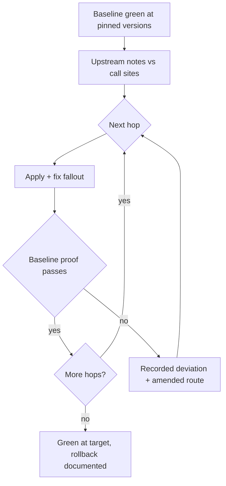

# Migrateify

[← All skills](../../README.md#skills) · [Hands-on tutorial](../../TUTORIAL.md) · [Runtime contract](SKILL.md) · [Behavior cases](../../evals/migrateify/cases.json)

> **Pinned baseline plus upstream notes in → staged, verified hops out.**

Migrateify moves dependencies, frameworks, and stored data to a target version without
losing the promises the current version keeps.

## The hop ladder

- **Baseline:** versions pinned, suite green, restore path named.
- **Notes:** every breaking change between pinned and target read against real call sites.
- **Hops:** one major version or one schema change per landed, verified step.
- **Data:** expand then contract; prove the backup restores before the first transform.

Each hop lands behind the same proof as the baseline. Evidence beats changelog prose
when they disagree, and every deviation is recorded, never absorbed.

## Migration flow



## Example

```text
Move our Postgres schema to split settings into a separate table. Production data,
about 40 GB. We cannot afford downtime past a five-minute window.
```

> [!IMPORTANT]
> A backup that has never been restored is a hope, not a rollback. Prove it before the
> first irreversible transform.
