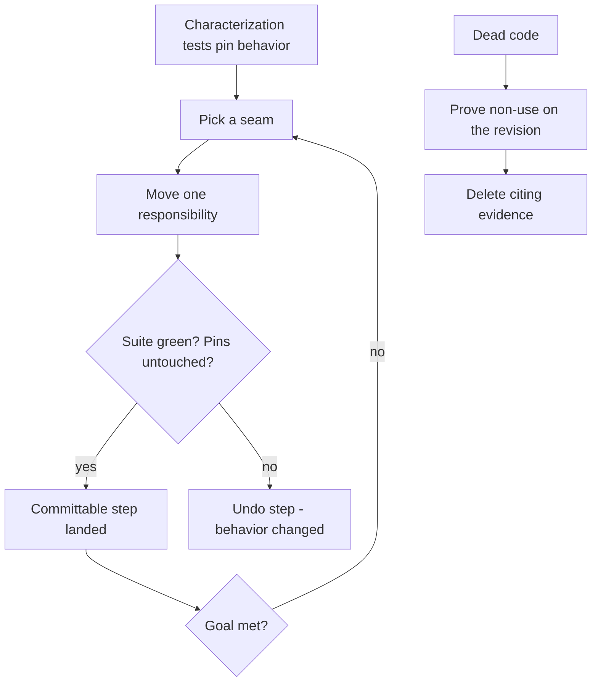

# Refactorify

[← All skills](../../README.md#skills) · [Runtime contract](SKILL.md) · [Behavior cases](../../evals/refactorify/cases.json)

> **Pinned behavior in → better structure with nothing observable changed out.**

Refactorify restructures code under two simultaneous proofs: structure improved, and
behavior held still.

## Refactor flow



## Example

```text
This 2,000-line service class is unreadable. Break it up without changing anything the
API consumers can see.
```

> [!IMPORTANT]
> Error messages, log lines, and accidental edge-case handling are observable behavior.
> Changing them on purpose is a feature; changing them mid-refactor is a broken pin.
