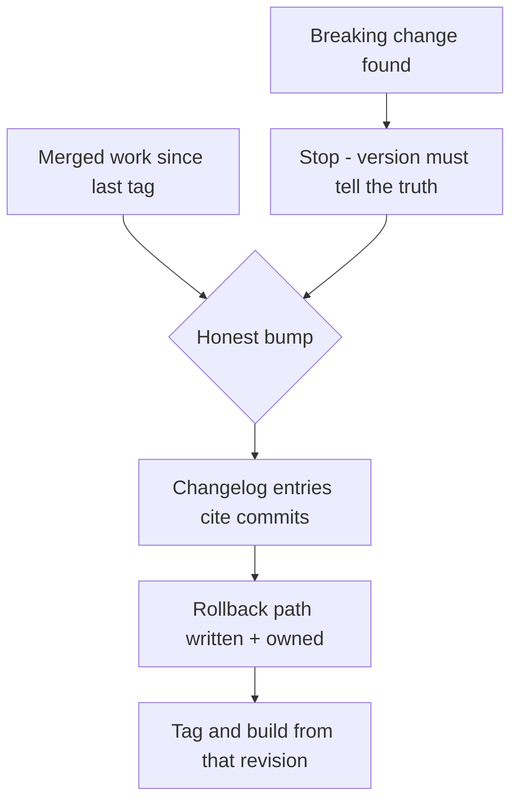

# Releaseify

[← All skills](../../README.md#skills) · [Runtime contract](SKILL.md) · [Behavior cases](../../evals/releaseify/cases.json)

> **Merged work in → an honest version, a traced changelog, and a rollback plan out.**

Releaseify makes the three claims of every release true: the version describes the
change, the changelog cites it, and the rollback can actually run.

## Release flow



## Example

```text
Cut the release for everything merged this week. Two of the PRs touched the public API.
```

> [!WARNING]
> A mislabeled version is a lie with downstream costs. Breaking work gets a major (or
> the project's equivalent), whatever the calendar says.
