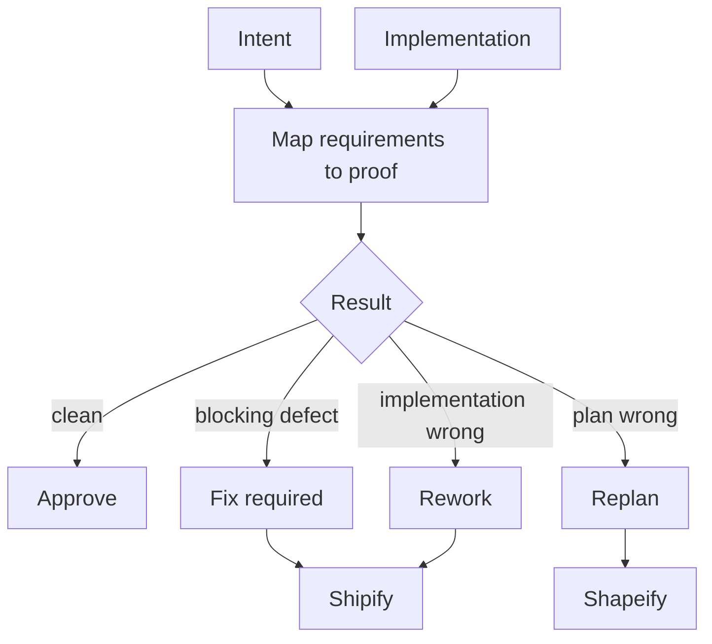

# Reviewify

[← All skills](../../README.md#skills) · [Hands-on tutorial](../../TUTORIAL.md) · [Runtime contract](SKILL.md) · [Weight modules](references/weights) · [Behavior cases](../../evals/reviewify/cases.json)

> **Implementation plus intent in → evidence-backed verdict out.**

Reviewify judges work against its intended behavior.

It reads intent before the diff, maps requirements and invariants to proof, chooses a
small set of relevant review lenses, traces a real failure path, filters style-only
comments, and issues one verdict.

## Verdicts

- **Approve:** no Blocking finding and every Material risk is fixed or accepted.
- **Fix required:** a Blocking defect exists but the design holds.
- **Rework:** implementation is wrong and the plan is sound.
- **Replan:** the plan itself is wrong.

## Verdict routing



## Example

```text
Review this diff against its worker packet. Return only located findings and one verdict.
```

> [!IMPORTANT]
> Heavy work cannot receive an approval verdict from its implementation writer.
