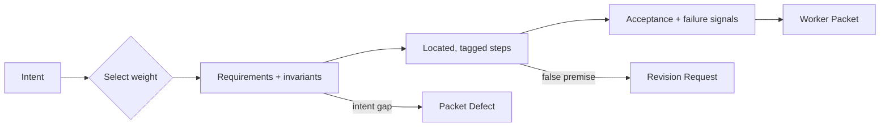

# Shapeify

[← All skills](../../README.md#skills) · [Runtime contract](SKILL.md) · [Weight modules](references/weights) · [Behavior cases](../../evals/shapeify/cases.json)

> **Settled intent in → junior-executable worker packet out.**

Shapeify converts settled intent into an executable worker packet.

## Weight modules

- **Light:** inline plan for a small reversible change.
- **Standard:** requirements, invariants, evidence, risks, located steps, and acceptance.
- **Heavy:** Standard plus decision owners, proof owners, recovery, and writer topology.

Each step names its location, verification, failure signal, and any plausible executor
trap. A false assumption produces a Revision Request. A change to intent produces a
Packet Defect.

## Packet construction



## Example

```text
Plan this production schema migration. Require rollback, recovery proof, isolated writer
lanes, and independent review.
```

> [!IMPORTANT]
> Weight changes proof depth. It never grants permission or expands scope.
