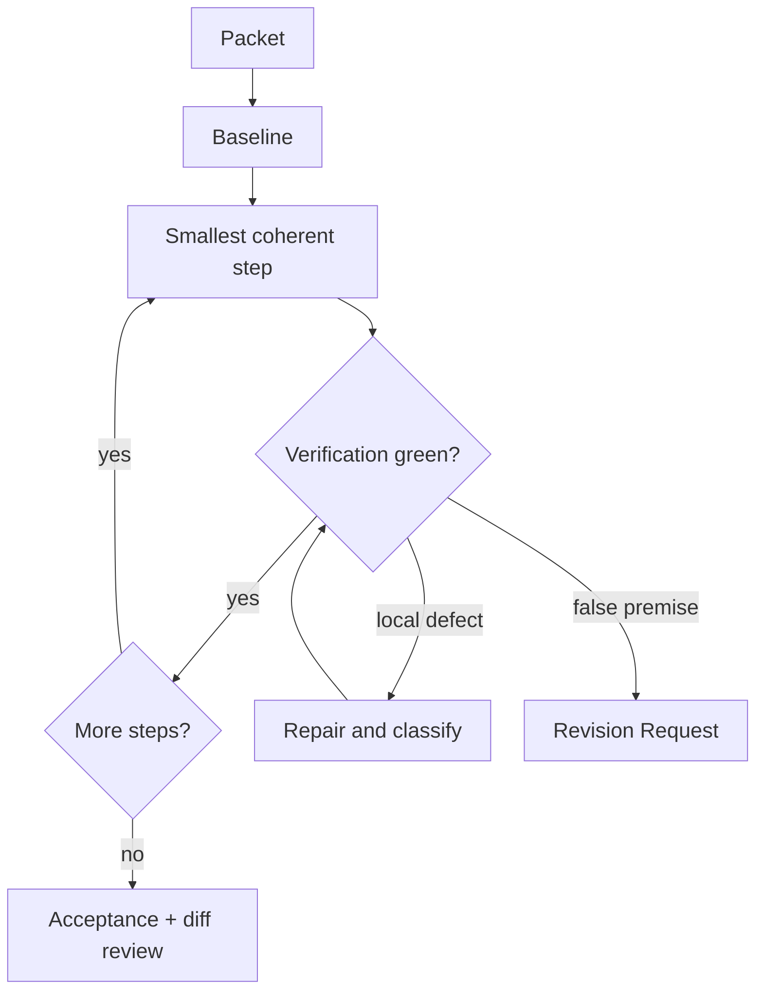

# Shipify

[← All skills](../../README.md#skills) · [Hands-on tutorial](../../TUTORIAL.md) · [Runtime contract](SKILL.md) · [Weight modules](references/weights) · [Behavior cases](../../evals/shipify/cases.json)

> **Approved packet in → verified implementation out.**

Shipify executes an approved packet or decision-ready request.

It establishes a baseline before editing, respects one-writer ownership, executes
isolated and batched steps differently, verifies each step, classifies every deviation,
and stops when evidence disproves a plan premise.

## Weight behavior

- **Light:** inline micro-packet and targeted proof.
- **Standard:** full packet execution and slice evidence.
- **Heavy:** Standard plus recovery checks, isolated writers, and independent review.

## Execution loop



## Example

```text
Apply this reversible two-file change. Run the direct test and inspect the final diff.
```

> [!WARNING]
> Editing does not complete a step. Observable evidence does.
