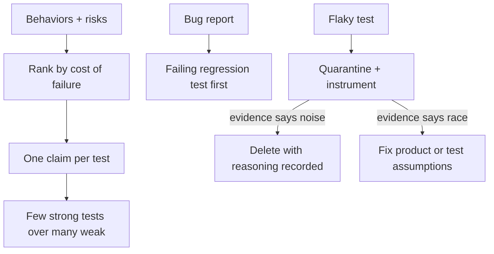

# Testify

[← All skills](../../README.md#skills) · [Runtime contract](SKILL.md) · [Behavior cases](../../evals/testify/cases.json)

> **Behavior and risk in → a suite of defensible bets out.**

Testify designs evidence: which behaviors deserve a test, which claim each test pins,
and when a flaky signal is quarantined instead of deleted.

## Evidence design flow



## Example

```text
We need tests for the billing module before the pricing refactor next week.
```

> [!IMPORTANT]
> Coverage measures what is untested, never what is important. A percentage is an
> observation, not a goal.
