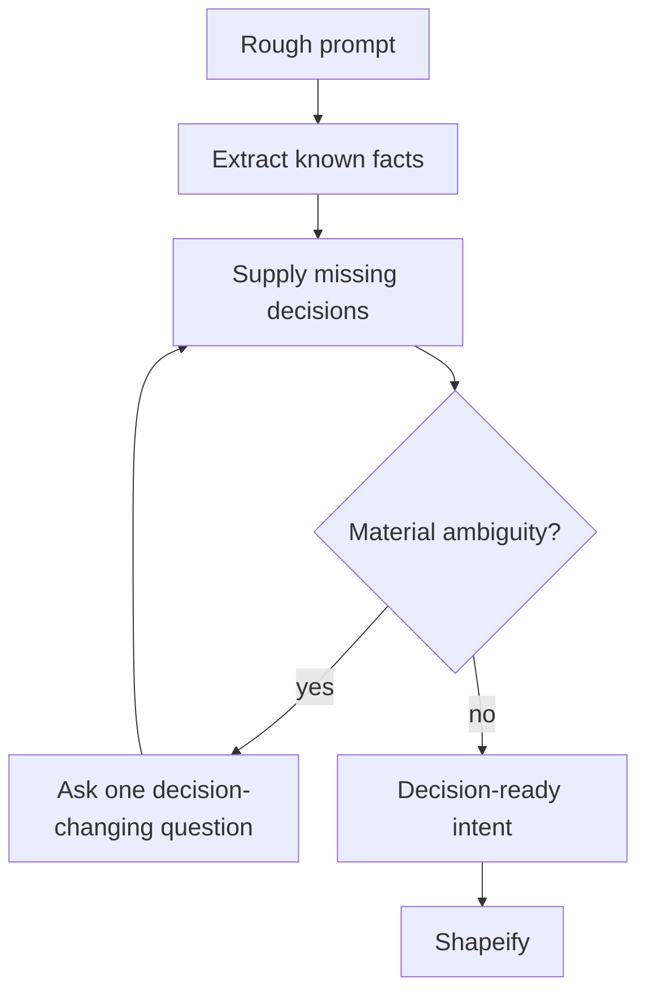

# Undumbify

[← All skills](../../README.md#skills) · [Hands-on tutorial](../../TUTORIAL.md) · [Runtime contract](SKILL.md) · [Behavior cases](../../evals/undumbify/cases.json)

> **Rough direction in → architect-grade intent out.**

Undumbify turns a rough direction into decision-ready intent.

It extracts what the user already knows and supplies the decisions an experienced
practitioner would notice. It asks only questions whose plausible answers produce
materially different outcomes. Discoverable facts are inspected instead of asked.

## Modes

- **Converge:** sharpen a vague direction.
- **Pressure-test:** find gaps in an existing plan.
- **Diverge:** offer distinct directions before convergence.
- **Handoff:** pass settled intent to Shapeify.

## Intent path



## Example

```text
I want login to feel faster and safer. Supply the missing decisions and ask only
questions that can change the architecture.
```

> [!NOTE]
> Discoverable facts are inspected. Questions are reserved for choices that change the outcome.
