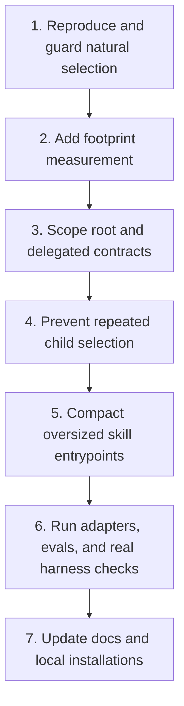

# Token-efficiency and selection-reliability plan

Status: **complete; independent Heavy review approved**

This packet reduces eager prompt loading without weakening Skillify's selection,
customization, authority, or handoff behavior. It also closes the evaluation gap exposed
when Codex activated Orientify but began repository inspection after a receipt instead of
showing the required choice card and waiting.

Start with [the worker packet](packet.md). It is intentionally self-contained so the work
can resume in a new session without this conversation.

## Baseline

- Source revision: `e1f1342` (`feat: add interactive custom controls`)
- Comparison revision before Custom controls: `ccd4c32`
- Current CI: passing
- Execution date: 2026-08-24
- Decision owner: repository owner
- Integration owner and only product-code writer: tomorrow's primary Worker

## Intended delivery order

Do not start contract compaction until the natural-flow regression test fails against the
current revision. Otherwise the implementation can become smaller while preserving the
wrong behavior.

Execution evidence: [S1 report](evidence/S1-report.md). The independent Heavy review
[approved the release](reviews/S1-review.md) with no remaining findings.
