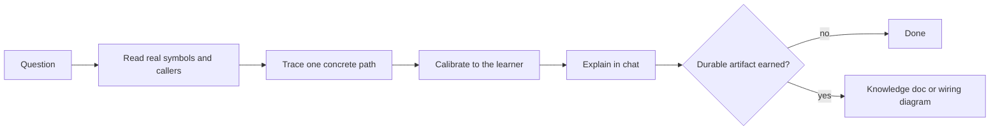

# Explainify

[← All skills](../../README.md#skills) · [Runtime contract](SKILL.md) · [Behavior cases](../../evals/explainify/cases.json)

> **Real code path in → working mental model out.**

Explainify teaches what code does and how its parts communicate.

It reads real symbols, callers, tests, and configuration. It follows one concrete path
from entry to exit. Ephemeral mode answers in chat. Tracked mode can maintain a learning
profile after an explicit request. Durable diagrams or knowledge documents are created
only when the scope or recurrence justifies them.

## Teaching path



## Example

```text
Use Explainify. Verbosity: Detailed. Explanation: Teaching.
Trace a request from the handler to persistence. Explain each boundary and one failure
path. Do not edit product code.
```

> [!NOTE]
> Ephemeral chat is the default. Explanation never grants permission to edit product code.
