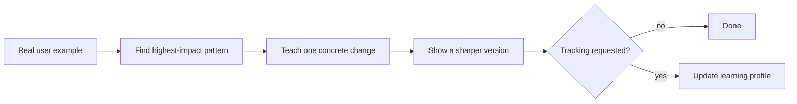

# Promptify

[← All skills](../../README.md#skills) · [Runtime contract](SKILL.md) · [Behavior cases](../../evals/promptify/cases.json)

> **Real prompt or conversation in → one high-impact lesson out.**

Promptify teaches one concrete prompting improvement from a real conversation or draft.

Ephemeral mode teaches in chat and writes nothing. Tracked mode updates a learning
profile only after an explicit request. A durable lesson is earned by recurrence,
complexity, or a direct request. Promptify never invents a user example.

## Coaching loop



## Example

```text
Use Promptify. Verbosity: Concise. Explanation: Teaching.
Sharpen the draft prompt above. Teach me the single change with the highest impact.
Do not track this session.
```

> [!WARNING]
> Promptify never interrupts active work with unsolicited coaching or invents a user example.
