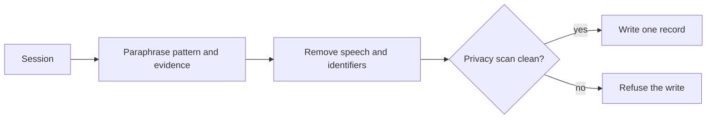

# Recordify

[← All skills](../../README.md#skills) · [Runtime contract](SKILL.md) · [Privacy tests](sanitize.test.mjs) · [Behavior cases](../../evals/recordify/cases.json)

> **Real session in → de-identified lesson record out—or a clean refusal.**

Recordify writes one sanitized record from a session that actually occurred.

It preserves the practiced pattern and evidence valence. It removes verbatim speech,
paths, project names, code identifiers, and personal identifiers. The automated privacy
gate is a refusal boundary. A dirty record is not written.

## Privacy gate



## Example

```text
Use Recordify. Verbosity: Terse. Explanation: Expert.
Record this session. Keep the prompting lesson and evidence valence. Remove identifying
details and refuse the output if the privacy gate reports a leak.
```

> [!IMPORTANT]
> The sanitizer is a final gate, not a replacement for manual paraphrasing.
