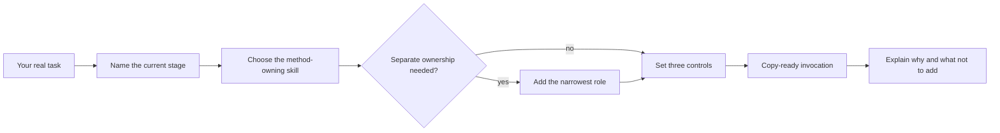

# Skillify

[← All skills](../../README.md#skills) · [Runtime contract](SKILL.md) · [Selection playbook](references/playbook.md) · [Behavior cases](../../evals/skillify/cases.json)

> **Your real task in → a skill-and-agent route you understand out.**

Skillify is the repository's teaching and routing skill. It helps a user learn which
method owns the current problem, whether a separate agent role adds value, and how to
set Weight, Verbosity, and Explanation independently.

## Lesson modes

| Mode | Best for | Result |
|---|---|---|
| **Route** | “What should handle this task?” | Smallest useful setup and copy-ready prompt |
| **Tour** | “How does this repository work?” | Relevant mental model without a catalog dump |
| **Practice** | “Teach me to choose correctly” | One scenario at a time with feedback |

## Teaching loop



> [!IMPORTANT]
> Skillify teaches and routes. It does not silently execute the example task or dispatch
> a fleet.

## Example

```text
Teach me which skills and agents I should use to fix an intermittent production bug.
Give me two or three concrete routes, recommend one, and let me choose before continuing.
```

Expected route: start with Traceify; add Worker only when the repair becomes an approved
implementation task; add Reviewer when risk requires independent proof.
