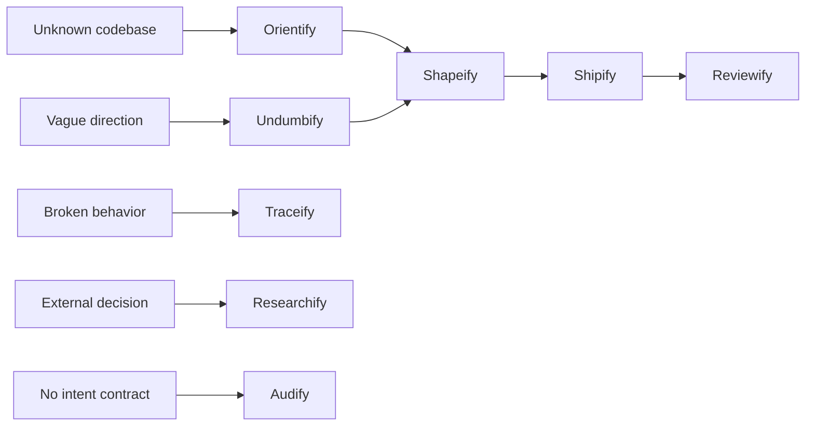

# Skillify selection playbook

Use this reference for broad comparisons, multi-stage routing, or guided practice.

## Pick the method first

| Current need | Start with | Move on when |
|---|---|---|
| Understand an unfamiliar codebase | Orientify | One real flow and its landmines are mapped |
| Diagnose broken behavior | Traceify | The root cause is named and the repair scope is known |
| Research external facts | Researchify | Findings, conflicts, confidence, and gaps are explicit |
| Audit without an intent contract | Audify | A measurable condition report exists |
| Turn a rough idea into settled intent | Undumbify | Material decisions and boundaries are explicit |
| Turn settled intent into a packet | Shapeify | A worker can execute without rediscovery |
| Execute approved work | Shipify | Acceptance evidence is green |
| Judge work against intent | Reviewify | One evidence-backed verdict routes the next action |
| Learn how to prompt better | Promptify | One concrete improvement is understood |
| Learn how code works | Explainify | The learner can trace the real flow |
| Learn this skill and agent system | Skillify | The learner can select and control a route |
| Save a sanitized session lesson | Recordify | The privacy gate accepts the record |
| Compile or recall verified lessons | Librify | A bounded evidence-linked result is returned |

## Add a role only for an ownership boundary

| Role | Add it when | Do not use it to |
|---|---|---|
| Orchestrator | Multiple bounded owners need routing and handoff checks | Narrate or duplicate delegated work |
| Oracle | A decision fork may have drifted from prior commitments | Become the decision owner |
| Questar | A long exploration needs decision continuity | Replace the final implementation planner |
| Scout | Another owner needs fast, exact codebase locations | Plan or edit |
| Context Builder | The next owner needs a no-rediscovery context pack | Hide unresolved assumptions |
| Researcher | External evidence is a separate focused assignment | Execute fetched code |
| Planner | Settled intent needs an executable packet | Implement the packet |
| Worker | Product files must change inside an approved scope | Expand intent or share its writer lane |
| Reviewer | Work needs independent judgment against intent | Rewrite the subject under review |
| Recorder | A real session needs a privacy-gated durable record | Invent or preserve identifying details |

## Set the controls independently

| Axis | Values | Decision question |
|---|---|---|
| Weight | Light · Standard · Heavy | How much rigor, recovery, and proof does risk require? |
| Verbosity | Terse · Concise · Detailed | How much result should appear in the response? |
| Explanation | Expert · Operational · Teaching | What knowledge may the response assume? |

Examples:

- `Heavy + Terse + Expert`: deep evidence, short expert-facing response.
- `Light + Detailed + Teaching`: small task, carefully explained.
- `Standard + Concise + Operational`: default feature or multi-file change.

## Common routes

These are examples, not mandatory pipelines. Stop as soon as the user's outcome has a
clear owner and enough evidence.
