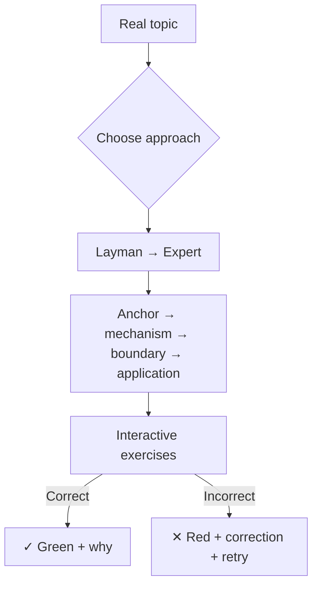

# Teachify

[← All skills](../../README.md#skills) · [Hands-on tutorial](../../TUTORIAL.md#5-learn-with-teachify) · [Runtime contract](SKILL.md) · [Teaching method](references/pedagogy.md) · [HTML contract](references/html-lessons.md) · [Behavior cases](../../evals/teachify/cases.json)

> **One subject, the right level, an interactive lesson that proves understanding.**

Teachify replaces separate coaching, explanation, recording, and library workflows with
one narrow promise: teach the requested subject well. It generates a self-contained HTML
lesson with immediate, accessible exercises. It does not build a learner database or
silently retain session content.



## Use it naturally

```text
Teach me how authentication cookies work. Assume I know web development but not
security. Give me exercises I can answer in the page.
```

Teachify infers its controls and then offers a small choice card. You do not need to write
`Weight`, `Verbosity`, or `Explanation` unless you want a precise override.

## Learner levels

| Level | Best for |
|---|---|
| Layman | No subject vocabulary assumed |
| Beginner | Learning the vocabulary and first reliable model |
| Practitioner | Applying the mechanism in realistic work |
| Advanced | Comparing trade-offs and diagnosing failure modes |
| Expert | Formal detail, edge conditions, and disputed assumptions |

The spelling is **Layman**. It describes background knowledge, never intelligence.

## Output

The default output is `lessons/<date>-<slug>.html`. It works offline and contains its CSS,
JavaScript, lesson, answers, feedback, and progress indicator in one file.

Validate a generated lesson:

```bash
node teaching/teachify/scripts/validate-lesson.mjs lessons/<lesson>.html
node scripts/test-teachify-interaction.mjs lessons/<lesson>.html
```

The second command executes the page's inline interaction code against wrong answers,
retries, correct answers, and progress—without adding a browser dependency.

> [!NOTE]
> A generated page stores progress only while that page is open. Teachify deliberately
> has no profile, transcript recorder, points system, or background memory.
